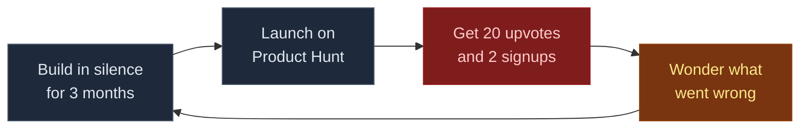
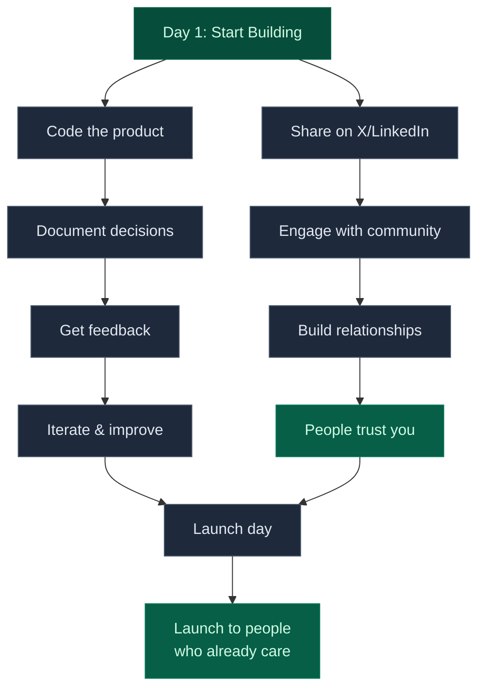

You probably found this blog through linkedin or x

That's the point. I've been shipping weekend projects for years - trading bots, nft marketplaces, ios apps, garmin watchfaces, e-commerce platforms, language learning tools. Most fail. Some stick. But they all get me excited

The problem? I was building in silence. I'd spend three months on a project, launch to zero users, then move on to the next thing. Rinse and repeat. The code was there. The products worked. But nobody knew they existed

## What Changed in 2025-2026

Something clicked when I saw the numbers. [82% of developers now use ai tools to write code](https://www.netcorpsoftwaredevelopment.com/blog/ai-generated-code-statistics). Microsoft and google announced that [a quarter of their code is ai-generated](https://www.technologyreview.com/2025/12/15/1128352/rise-of-ai-coding-developers-2026/). [cursor went from zero to 18% market share in 18 months](https://axis-intelligence.com/ai-coding-assistants-2026-enterprise-guide/)

The thing I spent years mastering - writing clean, efficient code - became a commodity almost overnight. Here's what I realized: the code I write matters less than the people who care about it. The competitive advantage - the moat - isn't technical skill anymore

### The Research That Convinced Me

I went deep on this. Read everything I could find about ai coding tools, indie hacker success stories, and the economics of building in public. The data was clear:

**Code is commoditizing fast**
- [Github copilot: 42% market share, 20M+ users](https://www.javacodegeeks.com/2025/12/ai-assisted-coding-in-2026-how-github-copilot-cursor-and-amazon-q-are-reshaping-developer-workflows.html)
- [Open-source alternatives matching quality at free tiers](https://axis-intelligence.com/ai-coding-assistants-2026-enterprise-guide/)
- [Pricing war coming: $20/month unlimited → $0.02-0.05 per request](https://dev.to/intelligenttools_tomic_85/ai-coding-in-2026-10-predictions-2ijb)

**But audience became valuable**
- [22% of linkedin creators making significant income from their presence](https://influenceflow.io/resources/personal-brand-building-on-linkedin-the-complete-2026-guide/)
- [Indie hackers with audiences: $57K-79K from side projects in 2025](https://www.indiehackers.com/post/79k-from-side-projects-in-2025-my-year-in-review-e145b2fa95)
- [Building in public shows 7-12x better conversion than product hunt launches](https://awesome-directories.com/blog/indie-hackers-launch-strategy-guide-2025/)

The indie hackers who succeeded weren't better developers. They had people who trusted them before they launched. That hit different

## Why This Matters for Weekend Builders

I build a lot. It's what gets me excited. Some weekend I'm building a trading bot. Next weekend it's an ios app. Then a garmin watchface. Then an e-commerce platform. I can't help it. The ideas keep coming and I love bringing them to life

But here's the pattern I kept repeating: build for three months → launch to zero users → get crickets → move to next project. The code was good. The products worked. But nobody knew they existed. That's when I saw what was happening with building in public

### The Build in Public Movement

Developers sharing their journey on x, linkedin, indie hackers. Documenting failures. Showing revenue numbers. Asking for feedback in public

Look, I usually hate all this indie hacker slang. Everyone acts like they're discovering something new, trying to hook you with guides on "how I made $10k mrr in 30 days" when most of these apps aren't generating any real money. But the terminology is everywhere, so here's what it actually means: **mrr** is monthly recurring revenue (subscription income), **moat** is your competitive advantage, **building in public** is sharing your journey while you build, **indie hackers** are solo founders, and the **grind** is just showing up consistently. None of this guarantees success. Most projects still fail. The only reason some of these projects actually succeed is because their creators have massive followings

One founder built a simple database gui tool. Nothing revolutionary. But he had 15,000 followers from years of teaching database concepts on twitter. Launched to $8k in the first month. Not because the product was better. Because people trusted him and wanted to support his work. Meanwhile, technically superior products with zero audience launched to crickets

## So I'm Documenting Everything Now

Here's what I decided to do. Every weekend project gets documented. Every failure gets shared. Every lesson learned goes in a blog post. Trading bots, ios apps, web3 experiments, ai integrations - all of it. Not because I think my projects are special. Because I'm building the asset that actually matters in 2026: an audience that trusts me

### The Shift in Approach

**Old approach:**

**New approach:**

The code quality is the same. The products are the same. But the outcomes are completely different. (btw, the above diagrams are [mermaid charts](/blog/claude-code-mastery-09-power-user-secrets) - generated with claude code)

### Why Weekend Projects Are Perfect for This

If you're like me - constantly starting new projects because you love building - this approach might actually work better. Most advice says "pick one thing and go deep for years." but that's not how I work. I get excited about new ideas. I want to try different tech. I like variety

When I'm building a new garmin watchface or experimenting with a crypto trading strategy, I'm genuinely curious about whether it'll work. That energy is real. And people connect with that. Building in public turns that into an asset. Every weekend project becomes content. Every pivot becomes a lesson. Every failure becomes a story. The portfolio of documented experiments might be more valuable than a single successful product. At least that's the bet I'm making

## Why You Might Want to Try This

Look, I don't know if this will work for me long-term. Maybe I'll build an audience of 10,000 people and launch products to warm leads. Maybe I'll have 47 followers and feel like an idiot for sharing everything publicly. But here's what I know for sure: the old approach wasn't working. Building in silence for months. Launching to crickets. Wondering why nobody cared about the thing I poured my heart into. That pattern needed to break

### What I'm Betting On

The thesis is simple: in a world where ai can write code, the differentiator is knowing what to build and who needs it. Building in public helps with both. **knowing what to build:** when you share your ideas early, people tell you if it's stupid. Saves months of building the wrong thing. **finding who needs it:** when you document your journey, people who care about the same problems naturally find you. They're your early adopters

The skills that matter now:
- understanding user needs (talk to humans)
- making good architectural decisions (can't delegate to ai yet)
- building trust and relationships (the actual moat)
- communicating what you're building and why (distribution)

Pure coding skill? Commoditized. The ability to ship code while building an audience? That might be the new rare skill

## The Experiment Continues

This blog is part of the experiment. Every weekend project I build gets documented here. Every failure gets shared. Every technical decision gets explained. Maybe this leads somewhere. Maybe it doesn't. But here's what I know: the worst case is I have a portfolio of documented work that shows what I can do. The best case is I build an audience that actually cares about what I'm building. Either outcome beats building in silence and wondering why nobody knows my projects exist
