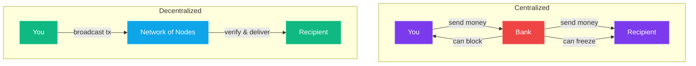

Imagine waking up tomorrow and your bank account is frozen. No warning, no explanation, just a message saying your funds are "under review." You can't pay rent. You can't buy groceries. You can't transfer money to your family. Everything you've earned, saved, and planned for—locked behind a door that someone else controls.

Think that sounds dramatic? It happened to millions of people in [Cyprus in 2013](https://en.wikipedia.org/wiki/2012%E2%80%932013_Cypriot_financial_crisis). The government literally took up to 47.5% of deposits over €100,000 to bail out failing banks. In [Greece in 2015](https://en.wikipedia.org/wiki/Capital_controls_in_Greece), ATM withdrawals were capped at €60 per day. In [Lebanon in 2019](https://en.wikipedia.org/wiki/Lebanese_liquidity_crisis), banks simply stopped letting people access their own money. In Canada in 2022, the government [invoked the Emergencies Act](https://en.wikipedia.org/wiki/Emergencies_Act) and froze bank accounts of people linked to protests they disagreed with.

Your money isn't really *yours* if someone else can decide you can't use it.

That's the problem crypto solves. And understanding that problem is way more important than understanding any technology behind it.

## Money Is Just a Story We All Agree On

Before we talk about crypto, we need to talk about money itself. Because here's the thing most people never think about: **money is made up.**

Not in a conspiracy-theory way. In a very literal, historically documented way.

Thousands of years ago, humans started with barter. I have fish, you have wheat, let's trade. Simple, but terrible at scale. What if I have fish but you don't want fish? What if your wheat won't be ready for three months? What if I need half a cow's worth of something—do I bring half a cow?

So we invented money. First it was shells, beads, salt (that's where the word "salary" comes from). Then it was gold and silver coins—valuable because the metal itself was scarce and hard to fake. Then paper money showed up, originally as IOUs backed by gold sitting in a vault somewhere. "Take this piece of paper to the bank and they'll give you actual gold."

Then something sneaky happened.

In 1971, President Nixon took the US dollar off the gold standard—an event known as the [Nixon Shock](https://en.wikipedia.org/wiki/Nixon_shock). Paper money was no longer backed by anything physical. It was backed by... trust. Trust that the government wouldn't print too much of it. Trust that everyone else would keep accepting it. Trust that the institutions managing it would behave responsibly.

That's where we are today. Every dollar, euro, and yen in existence is backed by nothing but collective agreement that it has value. Economists call this "[fiat money](https://en.wikipedia.org/wiki/Fiat_money)"—money by decree. The government says it's money, so it's money.

And honestly? That system works pretty well most of the time. Until it doesn't.

## 2008: The Year Trust Broke

Here's where our story really begins.

In 2008, the [global financial system nearly collapsed](https://en.wikipedia.org/wiki/2008_financial_crisis). Big banks had been packaging garbage mortgages into fancy financial products, rating agencies rubber-stamped them as safe, and when the house of cards fell, it took the entire global economy with it.

People lost their homes. Their retirement savings evaporated. Unemployment skyrocketed.

And what happened to the banks that caused it? **They got bailed out.** Taxpayer money—*your* money—was used to save the same institutions that nearly destroyed the economy. The executives kept their bonuses. [Almost nobody went to jail](https://en.wikipedia.org/wiki/Aftermath_of_the_2007%E2%80%932008_financial_crisis). The system that was supposed to protect people had instead protected itself.

On January 3rd, 2009—just months after the worst of the crisis—a mysterious person (or group) using the name [Satoshi Nakamoto](https://en.wikipedia.org/wiki/Satoshi_Nakamoto) launched Bitcoin. Embedded in the very first block (the [genesis block](https://en.bitcoin.it/wiki/Genesis_block)) was a message:

> "The Times 03/Jan/2009 Chancellor on brink of second bailout for banks"

That wasn't random. It was a headline from [The Times](https://en.wikipedia.org/wiki/The_Times) that day. A timestamp proving when Bitcoin started, and a middle finger to the system that had just failed everyone.

Satoshi's idea, laid out in the [Bitcoin whitepaper](https://bitcoin.org/bitcoin.pdf), was simple but radical: **what if we could have money that no bank, no government, and no institution could control?** Money that follows rules written in code, not rules written by politicians. Money that can't be inflated away, frozen, or confiscated.

That's Bitcoin. That's what started all of this.

## What "Decentralization" Actually Means

You've probably heard the word "decentralized" thrown around in crypto conversations. It sounds technical, but the concept is dead simple.

Think about how your bank works right now. There's one company—your bank—that keeps a record of how much money you have. When you send money to someone, the bank updates its records: subtract from your account, add to theirs. The bank is the **single source of truth.** If the bank says you have $500, you have $500. If the bank says you have $0, good luck arguing.

That's a **centralized** system. One entity in charge. One point of control. One point of failure.

Now imagine instead of one bank keeping the records, *thousands* of computers around the world all keep the same records simultaneously. When you send money, all of those computers verify and record the transaction. No single computer is in charge. No single entity can change the records. No one can freeze your account because there is no "account manager" to call.

That's decentralization. Instead of trusting one institution, you trust math and a network of thousands of independent participants who all keep each other honest.

- **Centralized:** One company controls everything → bank, PayPal, Venmo
- **Decentralized:** Thousands of participants share control → Bitcoin, Ethereum
- **The difference:** In a centralized system, you need permission. In a decentralized one, you don't.

## The Trust Problem (and Why "Trustless" Is a Good Thing)

Here's a word that confuses everyone at first: crypto people love saying the system is "trustless." That sounds *bad*, right? Who wants a system without trust?

But "trustless" doesn't mean "untrustworthy." It means **you don't have to trust anyone** for the system to work.

Think about buying something on Craigslist from a stranger. You don't trust them. They don't trust you. So what do you do? You meet in a public place, you inspect the item, you hand over cash, you both walk away. The transaction works *despite* the lack of trust because you've set up conditions where neither party can easily screw the other.

Traditional finance works on trust:
- You **trust** your bank to hold your money
- You **trust** the government not to inflate your currency into worthlessness
- You **trust** payment processors not to block your transactions
- You **trust** that the rules won't change after you've already played the game

Crypto replaces trust with verification. The rules are written in code that anyone can read. Transactions are verified by math, not by people. The system works the same way whether you're a billionaire or a teenager with a smartphone.

> **The key insight:** Every time you trust an intermediary with your money, you're making a bet that they'll act in your interest. History shows that bet doesn't always pay off.

## "Be Your Own Bank" Isn't Just a Slogan

When crypto people say "be your own bank," they're not being edgy. They're describing a real capability that matters enormously for billions of people.

**Consider these scenarios:**

**Capital controls.** You're a Venezuelan citizen watching your currency [lose 90% of its value](https://en.wikipedia.org/wiki/Crisis_in_Venezuela) in a year. The government says you can only exchange a tiny amount of bolivars for dollars. Your life savings is evaporating and you're legally forbidden from doing anything about it. With crypto, you can convert your money into an asset no government controls.

**The unbanked.** There are roughly [1.4 billion adults](https://www.worldbank.org/en/topic/financialinclusion/overview) on this planet who don't have a bank account. Not because they don't want one—because banks don't want *them.* They're not profitable enough, they live in the wrong country, they don't have the right documents. But most of them have a smartphone. And a smartphone is all you need to use crypto.

**[Remittances](https://en.wikipedia.org/wiki/Remittance).** A construction worker in Dubai sends money home to his family in the Philippines. Traditional services like Western Union take a 5-10% cut. The transfer takes 3-5 days. With crypto, it arrives in minutes and costs a few cents. That difference—that percentage the middleman takes—is food on the table for his kids.

**Censorship resistance.** Activists in authoritarian countries need to fund their operations. Journalists need to receive payments without their government knowing. Dissidents need to move money across borders. Traditional banking makes this nearly impossible when the government controls the banks.

This isn't theoretical. These are real problems affecting real people right now. Crypto doesn't solve all of them perfectly (yet), but it offers something that didn't exist before: **a financial system that doesn't require anyone's permission to participate in.**

## So Why Should You Care?

Maybe you don't live in Venezuela. Maybe you have a perfectly good bank account. Maybe the existing financial system works fine for you.

Here's why you should still pay attention:

**The internet had the same skeptics.** In the mid-90s, plenty of smart people said the internet was a fad for nerds. They had phones and fax machines—why would they need email? Fast forward 30 years and try living a single day without the internet. Crypto is at that same inflection point.

**Your money is losing value right now.** That savings account paying 0.5% interest while inflation runs at 3-6%? You're getting poorer every year. The [purchasing power of the dollar has dropped over 96% since 1913](https://www.officialdata.org/us/inflation/1913?amount=1). The system is designed to slowly erode the value of your savings because it encourages spending and borrowing—which is great for the economy, not so great for your future.

**The financial rails are showing their age.** It's 2026. You can stream 4K video to your phone in real-time, but sending money internationally still takes 3-5 business days and costs a fortune. Bank transfers fail on weekends. Credit card chargebacks take months. The payment infrastructure most of the world runs on was designed in the 1970s and it shows.

**Understanding crypto is understanding the future of money.** Whether crypto replaces traditional finance entirely (unlikely) or becomes a major component of it (very likely), understanding how it works gives you an edge. It's financial literacy for the 21st century.

> **Here's my take:** You don't need to go all-in on crypto. You don't need to become a Bitcoin maximalist or put your life savings into tokens. But understanding how this technology works and why it exists? That's not optional anymore. It's like understanding how the internet works in 2000—the people who got it early had a massive advantage.

## The Big Picture

Let's zoom out and summarize what we've covered:

1. **Money is a technology**, and like all technology, it evolves. We went from shells to gold to paper to digital to crypto.
2. **The current system requires trust** in governments, banks, and institutions. That trust has been broken repeatedly.
3. **The 2008 crisis** was the catalyst. Bitcoin was born as a direct response to institutional failure.
4. **Decentralization** means no single entity controls the system. Thousands of participants share the responsibility.
5. **"Trustless" is a feature**, not a bug. You don't need to trust anyone because the rules are enforced by code and math.
6. **"Be your own bank" matters** for billions of people who are underserved, censored, or exploited by traditional finance.
7. **This affects you** even if you think it doesn't. Understanding crypto is understanding the future of money.

None of this means crypto is perfect. It has real problems—scams, volatility, environmental concerns, complexity. We'll cover all of those honestly throughout this series. But understanding *why* it exists is the foundation everything else builds on.

The financial system wasn't broken for everyone. But it was broken for enough people that someone decided to build an alternative. And that alternative turned into a multi-trillion dollar ecosystem that's reshaping how the world thinks about money.

## What's Next

Now that you understand *why* crypto exists, it's time to understand *how* it started. In **[Part 2: Bitcoin — The One That Started It All](/blog/crypto-unlocked-02-bitcoin-digital-gold)**, we'll dive deep into how Bitcoin actually works. We'll demystify mining, explain what the blockchain really is (hint: it's just a fancy spreadsheet), and understand why a currency with no CEO, no headquarters, and no employees is worth over a trillion dollars.

No math degree required. Just bring curiosity.

[Series Index](/blog/series/crypto-unlocked) · [Next: Bitcoin — Digital Gold](/blog/crypto-unlocked-02-bitcoin-digital-gold) →

