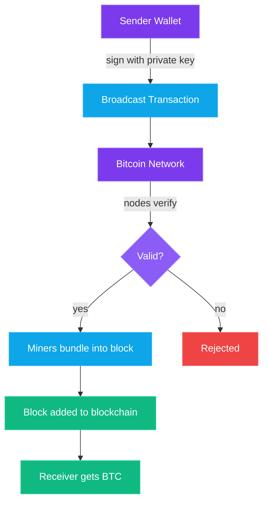

On May 22, 2010, a programmer named [Laszlo Hanyecz](https://en.wikipedia.org/wiki/Laszlo_Hanyecz) paid 10,000 Bitcoin for two Papa John's pizzas. At the time, that seemed like a reasonable deal—those coins were worth about $40 total. Today, those same 10,000 BTC are worth **hundreds of millions of dollars** — and briefly topped **one billion** when Bitcoin crossed $100K in late 2024. That's the most expensive pizza order in human history.

Every year, the crypto community celebrates May 22nd as ["Bitcoin Pizza Day"](https://en.wikipedia.org/wiki/History_of_bitcoin#2010)—part joke, part monument to how far this thing has come. But here's the thing most people miss about that story: **it proved Bitcoin actually worked as money.** Someone offered it, someone accepted it, value transferred from one person to another without a bank in sight.

In [Part 1](/blog/crypto-unlocked-01-why-crypto-exists), we covered *why* crypto exists—the broken trust, the bailouts, the 2008 meltdown. Now let's get into the *how*. How does Bitcoin actually work? What are miners doing? Why does everyone keep talking about "the halving"? And why do some very serious people call it digital gold?

No computer science degree required. Just stay with me. (And if you *do* want to go to the source, here's the [original Bitcoin whitepaper](https://bitcoin.org/bitcoin.pdf) — it's only 9 pages.)

## How Bitcoin Transactions Actually Work

Forget everything you think you know about digital payments. Bitcoin doesn't work like Venmo, PayPal, or your bank's app. There's no company in the middle moving numbers around in a database.

Here's how it works in plain English:

**You have a wallet.** Think of it as a lockbox with two keys. One key is public—it's basically your address, like an email address anyone can send Bitcoin to. The other key is private—it's the password that proves you own what's in the lockbox. **Never share your private key.** Ever. We'll drill into this in [Part 3](/blog/crypto-unlocked-03-wallets-keys-self-custody).

**You broadcast a transaction.** When you want to send Bitcoin to someone, you create a message that essentially says: "I'm sending 0.5 BTC from my address to this other address." You sign that message with your private key (proving you own the funds) and broadcast it to the Bitcoin network.

**The network verifies it.** Thousands of computers around the world receive your transaction, check your signature, confirm you actually have the Bitcoin you're trying to send, and—if everything checks out—add it to a queue of pending transactions.

**Miners bundle it into a block.** Every ~10 minutes, miners collect a batch of pending transactions, package them into a "block," and compete to add that block to the permanent record. More on this in a moment.

That's it. No bank approving your transaction. No three-day waiting period. No "business hours." Bitcoin works 24/7, 365 days a year, and doesn't care whether you're sending $5 or $5 million.

## The Blockchain: A Public Ledger Everyone Can Verify

The word "blockchain" gets thrown around like it's some mystical technology. It's not. **It's a spreadsheet.** A really big, really clever spreadsheet.

Imagine a notebook where every transaction ever made is written down in order. Every 10 minutes or so, someone tears off a page (that's a "block"), stamps it with a unique seal, and chains it to the previous page (that's the "chain"). Every page references the seal of the page before it, which means you can't rip out a page or change a past entry without breaking the chain.

Now imagine there are **thousands** of copies of this notebook, spread across computers all over the world. They all contain the exact same information. If someone tries to forge an entry in their copy, every other copy says "nope, that doesn't match." The lie gets rejected immediately.

That's the blockchain:
- **Transparent** — anyone can read it. Right now. Go to [mempool.space](https://mempool.space) or [blockstream.info](https://blockstream.info) and you can see every Bitcoin transaction happening in real-time
- **Immutable** — once a transaction is recorded, it can't be changed or deleted
- **Distributed** — no single company or server controls it. Thousands of independent computers (called "nodes") all maintain their own copy
- **Trustless** — you don't need to trust any single participant because *everyone* is watching everyone else

> **Think about it this way:** Your bank's ledger is a private diary locked in a vault. Bitcoin's blockchain is a diary written on a billboard in the town square—everyone can see it, everyone can verify it, and nobody can erase it.

## Mining Explained: What Miners Actually Do

This is where most people's eyes glaze over. But I promise it's simpler than you think.

Remember how transactions get bundled into blocks every ~10 minutes? Someone has to do that bundling. That someone is a "miner." But they don't just bundle transactions—they have to **earn the right** to add the next block. And they earn that right by solving a puzzle.

Here's the best analogy I've got:

**Imagine a room full of people, each rolling a massive set of dice.** The first person to roll a number below a certain target wins. There's no skill involved—you can't get "better" at rolling dice. You can only roll *faster* and *more often.* The person with the most dice (computing power) has the best odds, but even someone with a single die *could* win. It's a race of brute computational force.

When a miner "solves" the puzzle (finds a valid number), they broadcast their block to the network. Everyone else checks the answer (which is trivially easy to verify even though it was brutally hard to find), and if it's valid, the block gets added to the chain.

**The reward?** The winning miner gets two things:
1. **Newly created Bitcoin** — currently 3.125 BTC per block (worth roughly $300,000+ at today's prices)
2. **Transaction fees** — small fees paid by everyone whose transaction was included in that block

This is the *only* way new Bitcoin enters existence. There's no central bank printing it. No company issuing it. It's created through work—raw, verifiable, computational work.

*A Bitcoin mining facility in Medicine Hat, Alberta. Each container houses hundreds of specialized ASIC miners.*

## Proof of Work — Why It's Energy-Intensive and Why That Matters

That dice-rolling competition? It's called **[Proof of Work (PoW)](https://en.wikipedia.org/wiki/Proof_of_work)**, and it's the most controversial aspect of Bitcoin.

Here's why it exists: **you need skin in the game.** If adding blocks to the blockchain were free and easy, anyone could spam fake blocks, try to rewrite history, or double-spend their coins. Proof of Work makes cheating insanely expensive. To fake a transaction, you'd need to control more than 50% of all the computing power in the network—which, at Bitcoin's scale, would cost billions of dollars in hardware and electricity.

**The energy criticism is real.** Bitcoin mining consumes roughly as much electricity as a mid-sized country. Critics call it wasteful. And they have a point—if you measure value by electricity consumed, Bitcoin looks expensive.

**But here's the counter-argument:** What secures the global banking system? Thousands of bank branches, millions of employees, armored trucks, data centers, ATM networks, fraud departments, regulatory bodies, and military forces backing government currencies. Nobody tallies *that* energy bill. Bitcoin replaced all of that with math and electricity.

Is there room for improvement? Absolutely. And other cryptocurrencies (like Ethereum, which we'll cover in [Part 5](/blog/crypto-unlocked-05-solana-speed-at-scale)) have found less energy-intensive alternatives. But for Bitcoin specifically, the energy expenditure *is* the security. That's a feature, not a bug.

> **Hot take:** The energy debate is important, but it often gets weaponized by people who don't apply the same scrutiny to the traditional financial system. Both use enormous resources. Only one of them lets you verify every single transaction yourself.

## The Halving: Bitcoin's Built-In Scarcity Engine

Every four years (roughly every 210,000 blocks), something remarkable happens: **the reward miners get for each block is cut in half.** This is called ["the halving,"](https://www.bitcoinblockhalf.com/) and it's one of the most elegant mechanisms in all of economics.

Here's the timeline:
- **2009:** Mining reward = 50 BTC per block
- **November 2012:** First halving → 25 BTC
- **July 2016:** Second halving → 12.5 BTC
- **May 2020:** Third halving → 6.25 BTC
- **April 2024:** Fourth halving → 3.125 BTC
- **~2028:** Fifth halving → 1.5625 BTC
- **~2140:** Final Bitcoin mined. Reward = 0 BTC

See what's happening? The supply of new Bitcoin entering the market **keeps shrinking.** Like a faucet being slowly turned off. Meanwhile, demand has generally been increasing as more people, companies, and even governments adopt Bitcoin.

Historically, each halving has preceded a significant bull run. Not immediately—usually 6-18 months later. Past performance isn't a guarantee, obviously. But the economic logic is sound: **if supply decreases while demand stays the same or increases, price goes up.** That's not crypto magic—that's Econ 101.

The next halving is expected around **April 2028**. Mark your calendar. Or don't—the crypto community will not let you forget about it. You can track the countdown live at [bitcoinblockhalf.com](https://www.bitcoinblockhalf.com/).

## 21 Million: The Hardest Money Ever Created

Here's where Bitcoin gets truly interesting from a monetary perspective.

**There will only ever be 21 million Bitcoin.** Not 21 million and one. Not "well, we might adjust that later." Twenty-one million. Period. It's written into the code, enforced by every node on the network, and mathematically guaranteed by the halving schedule.

Compare that to fiat money:

- The US Federal Reserve created **$4.6 trillion** in 2020 alone in response to COVID
- The [M2 money supply](https://fred.stlouisfed.org/series/M2SL) (a measure of all dollars in existence) has roughly **quadrupled** since 2000
- Every major central bank in the world has the ability to print unlimited currency whenever they decide it's necessary

When governments print money, your existing money buys less. That $100 in your savings account from 2020 buys roughly $80 worth of stuff today. You didn't spend it. You didn't lose it. The government just made more of it, diluting yours like adding water to wine.

**Bitcoin can't be diluted.** Nobody can print more of it. Nobody can change the 21 million cap without convincing the majority of the global network to agree—which is about as likely as convincing every country on Earth to simultaneously switch to a new language.

This is what people mean when they call Bitcoin **"hard money"** or **"sound money."** It's programmatically scarce. No human decision can change that. And in a world where every government has a printing press, that's a genuinely new thing.

> **Perspective:** About [19.9 million Bitcoin have already been mined](https://www.coindesk.com/price/bitcoin/). With ~8 billion people on Earth, if everyone wanted some, there's only about 0.0025 BTC per person. And an estimated 3-4 million BTC are lost forever (forgotten passwords, dead owners, [Satoshi's untouched stash](https://en.wikipedia.org/wiki/Satoshi_Nakamoto)). The actual available supply is even smaller than you think.

## Bitcoin as "Digital Gold" — The Store of Value Thesis

Gold has been valuable for thousands of years. Why? It's scarce (you can't make more), it's durable (it doesn't rust or decay), it's divisible (you can melt it into smaller pieces), it's portable (sort of), and it's universally recognized.

Bitcoin has every single one of those properties—and then some:

- **Scarce** — Gold: Yes (limited supply on Earth) · Bitcoin: Yes (21M cap, mathematically enforced)
- **Durable** — Gold: Yes (doesn't decay) · Bitcoin: Yes (exists as long as the network runs)
- **Divisible** — Gold: Somewhat (hard to split a gold bar) · Bitcoin: Extremely (divisible to 8 decimal places—0.00000001 BTC is called a "satoshi")
- **Portable** — Gold: Barely (try flying with $1M in gold) · Bitcoin: Completely (send $1B across the world in minutes)
- **Verifiable** — Gold: Hard (need an expert to detect fakes) · Bitcoin: Trivial (the blockchain verifies everything)
- **Seizure-resistant** — Gold: No (governments confiscate gold routinely) · Bitcoin: Very (if you hold your own keys)

The "digital gold" thesis is simple: **Bitcoin is a better store of value than gold for the digital age.** It's harder to confiscate, easier to transfer, impossible to counterfeit, and provably scarce.

This isn't just internet speculation. [BlackRock](https://www.blackrock.com/)—the largest asset manager in the world with over $10 trillion under management—launched a [Bitcoin ETF (IBIT)](https://www.blackrock.com/us/individual/products/ibit-ishares-bitcoin-trust) in January 2024. Nation-states are adding Bitcoin to their reserves. [Strategy (formerly MicroStrategy)](https://en.wikipedia.org/wiki/MicroStrategy) holds over 650,000 BTC — tens of billions of dollars on their balance sheet — making them the largest corporate Bitcoin holder in the world.

When the biggest, most conservative financial players in the world start buying, it's worth paying attention.

## A Brief, Wild History

Bitcoin's journey from cypherpunk experiment to trillion-dollar asset is one of the wildest rides in financial history:

- **2009:** [Satoshi Nakamoto](https://en.wikipedia.org/wiki/Satoshi_Nakamoto) mines the [genesis block](https://en.wikipedia.org/wiki/Genesis_block) on January 3rd. Bitcoin is worth $0.
- **2010:** Pizza Day. 10,000 BTC for two pizzas. First real-world transaction.
- **2011:** Bitcoin hits $1 for the first time. Then $31. Then crashes back to $2. Welcome to crypto.
- **2013:** Bitcoin reaches $1,000. The world starts paying attention.
- **2014:** [Mt. Gox](https://en.wikipedia.org/wiki/Mt._Gox), the largest Bitcoin exchange handling 70% of all trades, collapses. 850,000 BTC go missing (200,000 later recovered). Trust shattered. Price crashes. Many declare Bitcoin dead (for the first of about 400 times).
- **2017:** The ICO bubble. Bitcoin hits $20,000. Your Uber driver is talking about crypto. Then it crashes 84%.
- **2020-2021:** Institutional adoption begins. Tesla buys $1.5B in Bitcoin. [El Salvador becomes the first country to make it legal tender](https://en.wikipedia.org/wiki/Bitcoin_in_El_Salvador) (later reversed in 2025). Bitcoin hits $69,000.
- **2024:** [Spot Bitcoin ETFs approved](https://www.sec.gov/newsroom/speeches-statements/gensler-statement-spot-bitcoin-011023) in January. The fourth halving happens in April. Bitcoin crosses **$100,000** for the first time in December. The "internet money" is now a mainstream financial asset.

Every crash was declared the end. Every recovery proved the skeptics wrong. Bitcoin has been pronounced dead hundreds of times and keeps coming back stronger. That resilience isn't just price action—it's a network effect that gets harder to kill the bigger it grows.

## What Bitcoin Isn't (Let's Be Honest)

No honest guide would skip the limitations:

- **It's not fast for payments.** Bitcoin processes ~7 transactions per second. Visa does ~65,000. Layer 2 solutions like the [Lightning Network](https://lightning.network/) are improving this, but it's not there yet for buying your morning coffee.
- **It's volatile.** Dropping 30-50% in a matter of weeks is *normal* for Bitcoin. If that makes you queasy, that's important to know before you invest.
- **It's not anonymous.** It's *pseudonymous*. Your identity isn't attached to your address, but every transaction is public. If someone links your identity to an address, they can trace everything.
- **It's not easy for beginners.** Lose your private key? Your Bitcoin is gone forever. No customer support. No "forgot password." We'll solve this in [Part 3](/blog/crypto-unlocked-03-wallets-keys-self-custody).

Understanding what Bitcoin *can't* do is just as important as understanding what it can. It's a store of value and a settlement network, not a competitor to Apple Pay. At least not yet.

## What's Next

You now understand how Bitcoin works under the hood—the blockchain, mining, proof of work, the halving, and the 21 million cap. You know why people call it digital gold and why that comparison holds up better than most critics admit.

But here's the thing: **none of this matters if you can't secure your own Bitcoin.** And the way most people store crypto today—on exchanges—is about as safe as leaving cash on someone else's kitchen table and hoping they don't touch it.

In **[Part 3: Wallets & Self-Custody](/blog/crypto-unlocked-03-wallets-keys-self-custody)**, we'll cover how to actually hold your own crypto. Hot wallets vs. cold wallets, seed phrases, hardware devices, and the golden rule: **not your keys, not your coins.** This is the most important practical lesson in the entire series.

Don't skip it.

← [Previous: Why Crypto Exists](/blog/crypto-unlocked-01-why-crypto-exists) · [Series Index](/blog/series/crypto-unlocked) · [Next: Wallets, Keys & Self-Custody](/blog/crypto-unlocked-03-wallets-keys-self-custody) →

