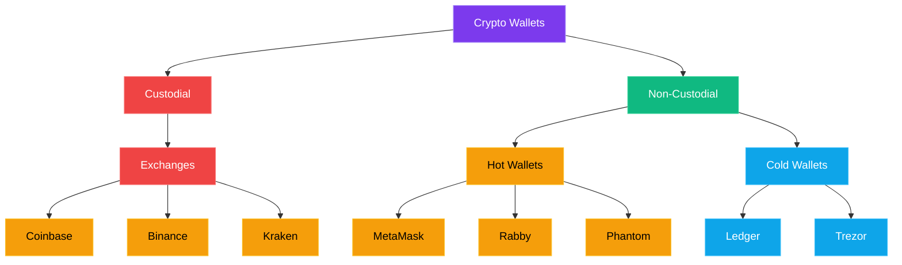

In November 2022, over a million people woke up to find their crypto gone. Not hacked. Not stolen by some shadowy figure in a hoodie. Just... *gone*. The exchange they trusted — [FTX](https://en.wikipedia.org/wiki/FTX_(company)), run by the curly-haired golden boy of crypto — had been gambling with their money behind the scenes. Billions of dollars, [evaporated overnight](https://www.reuters.com/business/finance/ftx-crypto-exchange-files-bankruptcy-2022-11-11/).

The cruel irony? Every single one of those people could have prevented it. Not with better research, not with insider knowledge — just by holding their own keys.

That's what this chapter is about. Keys, wallets, and why taking custody of your own crypto is the single most important thing you'll learn in this entire series.

## Your Keys, Explained (With a Simple Analogy)

Let's start with the basics. In crypto, you have two keys:

- **Public key** — This is your address. Think of it like your email address. You can share it freely. People need it to send you crypto. It looks something like `0x7a16fF8270133F063aAb6C9977183D9e72835428` (yes, it's ugly — that's normal).

- **Private key** — This is your password. Except it's way, *way* more important than any password you've ever had. If someone gets your private key, they own your crypto. Period. No customer support to call. No "forgot password" link. No bank to reverse the transaction. It's gone.

Here's where the analogy breaks down, though — and this is crucial to understand:

> **With your email, you can always reset your password. With crypto, there is no reset. Your private key IS your ownership. Lose it or leak it, and it's game over.**

You don't actually "store" crypto in a wallet the way you store cash in a physical wallet. Your crypto lives on the blockchain (that shared ledger we talked about in [Part 1](/blog/crypto-unlocked-01-why-crypto-exists)). Your private key is just the proof that you're allowed to move it. The wallet is really just software that manages your keys for you.

## Seed Phrases: The Master Key

Now, private keys are long, random strings of characters. Impossible to remember. So the crypto world came up with something more human-friendly: **seed phrases** (also called recovery phrases or mnemonic phrases).

When you create a new wallet, you'll be shown 12 or 24 random English words. Something like:

```
apple  river  sunset  monkey  carpet  bridge
oxygen  canvas  turtle  phantom  garden  vault
```

These words **are** your wallet. More precisely, they're a human-readable encoding of your private key. From these 12 words, your wallet software can mathematically derive every private key and address your wallet will ever use.

This means:
- ✅ Write them down → you can restore your wallet on any device, anytime
- ❌ Lose them → you lose access to your crypto forever
- ❌ Someone else gets them → they can steal everything in seconds


> **💡 Tip:** Write your seed phrase on paper. Not in your Notes app. Not in a screenshot. Not in an email to yourself. Paper. Maybe two copies, stored in different physical locations. Some people even engrave them on metal plates to survive fire and water damage. That's not paranoia — that's good practice.

## Hot Wallets vs. Cold Wallets




Wallets come in two flavors, and understanding the difference matters:

### Hot Wallets (Software Wallets)
These are apps on your phone or browser extensions on your computer. They're "hot" because they're connected to the internet.

**Popular hot wallets:**
- **[MetaMask](https://metamask.io)** — The OG browser wallet. Works with Ethereum and most EVM-compatible chains. Browser extension + mobile app.
- **[Rabby](https://rabby.io)** — A newer, slicker alternative to MetaMask with better security warnings and multi-chain support. My personal daily driver.
- **[Phantom](https://phantom.com)** — Started on Solana, now supports Ethereum and Bitcoin too. Clean interface, great mobile app.

**Pros:** Free, convenient, instant access, easy to use
**Cons:** Connected to the internet = more vulnerable to hacks, malware, and phishing

Hot wallets are great for day-to-day crypto activity — interacting with apps, swapping tokens, exploring DeFi. Think of them as the cash in your pocket.

### Cold Wallets (Hardware Wallets)
These are physical devices — usually small USB-like gadgets — that store your private keys offline. They're "cold" because they never touch the internet directly.

**Popular cold wallets:**
- **[Ledger](https://www.ledger.com)** (Nano S Plus, Nano X, Stax) — The market leader. Sleek hardware, solid app ecosystem. Had a controversial [data breach of customer *shipping addresses*](https://www.ledger.com/blog/update-efforts-to-protect-your-data-and-prosecute-the-scammers) (not keys) in 2020, and a [firmware controversy](https://www.ledger.com/blog/part-4-genesis-of-ledger-recover-self-custody-without-compromise) around Ledger Recover in 2023, but the actual key security has held up.
- **[Trezor](https://trezor.io)** (Model One, Model T, Safe 3) — Open-source firmware, which the security community loves. Strong track record.

**Pros:** Keys never leave the device, immune to remote hacks, the gold standard for security
**Cons:** Cost money (~€60-200), less convenient for frequent transactions, you can still lose the physical device

> **💡 Rule of thumb:** If you wouldn't walk around with that amount of cash in your pocket, it shouldn't be in a hot wallet. Hardware wallet for savings, hot wallet for spending money.

## "Not Your Keys, Not Your Coins"

This is the most-repeated phrase in crypto, and after FTX, nobody argues with it anymore.

Here's the deal. When you buy crypto on an exchange like [Coinbase](https://www.coinbase.com), [Binance](https://www.binance.com), or [Kraken](https://www.kraken.com), you don't actually hold that crypto. The exchange does. They have the private keys. You have an IOU — a balance on their platform that says "we owe you 0.5 BTC."

That's **custodial** storage. They're the custodian. You're trusting them.

And most of the time? It works fine. These are big companies with security teams and insurance policies. But "most of the time" isn't "all of the time."

### The FTX Disaster

FTX was the third-largest crypto exchange in the world by volume. Celebrity endorsements. Super Bowl ads. Sam Bankman-Fried was on magazine covers, advising Congress, being called the "next Warren Buffett."

Behind the scenes, FTX was funneling customer deposits — billions of dollars — to prop up risky bets at their sister trading firm, [Alameda Research](https://en.wikipedia.org/wiki/Alameda_Research). When [CoinDesk revealed](https://www.coindesk.com/business/2022/11/02/divisions-in-sam-bankman-frieds-crypto-empire-blur-on-his-trading-titan-alameda-s-balance-sheet/) that Alameda's balance sheet was heavily dependent on FTX's own FTT token, a bank run followed — and the money simply wasn't there.

**Result:** An [$8 billion hole](https://en.wikipedia.org/wiki/Bankruptcy_of_FTX) in customer funds, gone. People who had their life savings on FTX couldn't withdraw a single dollar. Bankman-Fried was [convicted of fraud](https://www.nytimes.com/2023/11/02/technology/sam-bankman-fried-fraud-trial-ftx.html) in November 2023, and the bankruptcy process dragged on for years.

The people who had moved their crypto to their own wallets? They were fine. Completely unaffected. Because *they* held the keys.

### Custodial vs. Non-Custodial


Let me make this crystal clear:

- **Who holds the keys?** — Custodial: The exchange · Non-Custodial: You
- **Can you be frozen out?** — Custodial: Yes · Non-Custodial: No
- **Recovery if you lose access?** — Custodial: Customer support · Non-Custodial: Seed phrase only
- **Risk** — Custodial: Exchange hack, fraud, bankruptcy · Non-Custodial: Losing your seed phrase, personal security
- **Example** — Custodial: Coinbase, Binance, Kraken · Non-Custodial: MetaMask, Ledger, Phantom

Neither approach is inherently "wrong." Keeping some crypto on a reputable exchange is fine, especially if you're actively trading. But for long-term holdings — for anything you'd be devastated to lose — self-custody is the way.

## Security Best Practices

Alright, real talk. Here's how to not get rekt:

### The Non-Negotiables
1. **Never, ever share your seed phrase.** No legitimate service, wallet, or person will ever ask for it. If someone asks, it's a scam. 100% of the time.
2. **Write it on paper (or metal), store it offline.** Not on your computer. Not in the cloud. Not in a photo.
3. **Use a hardware wallet for significant amounts.** "Significant" is subjective — but if losing it would hurt, it's significant.
4. **Double-check addresses before sending.** Crypto transactions are irreversible. Send a small test amount first if you're nervous. There's no shame in that.
5. **Use a separate browser profile for crypto.** Keep your wallet extension isolated from your everyday browsing.

### Common Scams to Watch For

The crypto space is unfortunately rich with people trying to separate you from your money. Here are the big ones:

- **Fake wallet apps** — Scammers create copycat wallet apps on app stores. Always download from the official website, never from a random link. Check the developer name, review count, and URL carefully.
- **Phishing sites** — You get a DM or email: "Your wallet has been compromised! Click here to secure your funds." The link takes you to a site that looks exactly like MetaMask or your exchange. You enter your seed phrase, and it's over. **No legitimate service will ask you to "verify" or "validate" your wallet via a link.**
- **Social engineering** — "Hey, I'm from MetaMask support" in your Discord DMs. No, they're not. Wallet companies don't DM you. Ever.
- **Approval scams** — You connect your wallet to a malicious website and approve a transaction you don't fully understand. That approval lets the site drain your tokens. Always read what you're signing, and revoke old approvals regularly (tools like [revoke.cash](https://revoke.cash) help with this).
- **Clipboard malware** — You copy a wallet address, malware swaps it with the attacker's address, and you send funds to the wrong place. Always verify the first AND last few characters of any address you paste.

> **💡 The golden rule of crypto security:** Slow down. Scammers rely on urgency. "Act now or lose your funds!" is almost always a scam. Real security issues don't require you to enter your seed phrase into a website.

## Getting Started: Your First Wallet

Ready to set one up? Here's the simplest path:

1. **Download a hot wallet** — I'd recommend [Rabby](https://rabby.io) or [MetaMask](https://metamask.io). Go directly to the official website. Don't Google it and click an ad — [fake wallet scams are rampant](https://support.metamask.io/more-web3/staying-safe/will-metamask-ever-ask-me-to-verify-my-account/).
2. **Create a new wallet** — The app will generate your seed phrase. Write it down immediately. On paper.
3. **Verify your seed phrase** — The app will quiz you on it. This isn't busy work — it's making sure you actually wrote it down.
4. **Store your seed phrase safely** — Somewhere secure, offline, where you won't lose it and nobody else can find it.
5. **Optional but recommended** — Once you have meaningful amounts, invest in a [Ledger](https://www.ledger.com) or [Trezor](https://trezor.io) and move your long-term holdings there.

That's it. You now have a non-custodial wallet. You hold the keys. You own the coins. Nobody — no government, no company, no hacker on the other side of the world — can touch your crypto without your private key.

That's the promise of self-custody. It's also the responsibility. And in crypto, those two things are inseparable.

## What's Next?

You've got your wallet set up. You understand keys, seed phrases, and why self-custody matters. But so far, we've mostly talked about crypto as *money* — something you send and receive.

In **[Part 4](/blog/crypto-unlocked-04-ethereum-smart-contracts)**, we're going to blow the doors open. We'll dive into **Ethereum and Smart Contracts** — where crypto stops being just digital cash and becomes a programmable platform that can run code, enforce agreements, and power entirely new kinds of applications. This is where things get really interesting.

See you there. 🔑
---

← [Previous: Bitcoin — Digital Gold](/blog/crypto-unlocked-02-bitcoin-digital-gold) · [Series Index](/blog/series/crypto-unlocked) · [Next: Ethereum & Smart Contracts](/blog/crypto-unlocked-04-ethereum-smart-contracts) →
