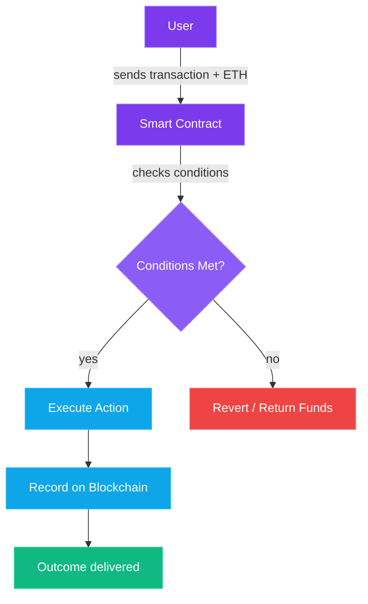

If Bitcoin is a calculator, Ethereum is a full-blown computer.

That's the single most important thing to understand about Ethereum. Bitcoin does one thing really well: it moves value from A to B without a middleman. That's incredible. But it's also... kind of it. Bitcoin's scripting language is intentionally limited. You can send money, you can lock money with conditions, and that's about where the party ends.

Ethereum looked at that and said: "What if the blockchain could run *any* program?"

And that question changed everything.

## The Kid Who Wanted Programmable Money

In 2013, a 19-year-old Russian-Canadian programmer named [Vitalik Buterin](https://en.wikipedia.org/wiki/Vitalik_Buterin) published a [whitepaper](https://ethereum.org/en/whitepaper/). He'd been deep in the Bitcoin world — co-founding [Bitcoin Magazine](https://bitcoinmagazine.com/) as a teenager — but he kept running into the same wall. Every time someone wanted to build something new on a blockchain, they had to create an entirely new blockchain. Want decentralized betting? New chain. Want to issue tokens? New chain. Want domain names on-chain? You guessed it.

Vitalik's insight was elegant: instead of building a new blockchain for every application, build *one* blockchain that can run any application. As he later wrote on [his blog](https://vitalik.eth.limo/), the goal was a platform with a built-in Turing-complete programming language. A general-purpose world computer, secured by the same cryptographic principles as Bitcoin, but infinitely more flexible.

Ethereum [launched on July 30, 2015](https://ethereum.org/en/history/#frontier). The crypto world hasn't been the same since.

## Smart Contracts: The Vending Machine Analogy

Here's where people's eyes start to glaze over, so let me keep this dead simple.

A **smart contract** is just a program that lives on the blockchain. It has rules baked into its code, it executes automatically when conditions are met, and — here's the key part — no human needs to be involved.

Think of a vending machine:

1. You put money in
2. You select what you want
3. The machine checks if you paid enough
4. If yes → it gives you the item
5. If no → it returns your money

No cashier. No negotiation. No trust required. The rules are the rules, and the machine enforces them.

Smart contracts work exactly the same way, except instead of candy bars, they handle money, tokens, property rights, votes, insurance payouts — really anything you can express as logic.

> **The "smart" in smart contracts doesn't mean AI-smart.** It means self-executing. The contract does exactly what it's programmed to do, every single time, without anyone being able to tamper with it. That's the magic.

Here's a simple example in plain English:

- **IF** Alice sends 1 ETH to this contract
- **AND** the date is after January 1st, 2026
- **THEN** send that 1 ETH to Bob
- **ELSE** return it to Alice

Once deployed, nobody can change those rules. Not Alice, not Bob, not even the person who wrote the contract. It just... runs. On thousands of computers simultaneously, all verifying each other.

## The EVM: Ethereum's Engine

So where do these smart contracts actually *run*? On the **[Ethereum Virtual Machine](https://ethereum.org/en/developers/docs/evm/)** — the EVM.

Think of the EVM as a giant, decentralized computer. Every node (computer) on the Ethereum network runs a copy of the EVM. When you deploy a smart contract, every node gets a copy. When someone interacts with that contract, every node executes the code and agrees on the result.

This is wildly inefficient by traditional computing standards. Your laptop could run these programs a million times faster than Ethereum can. But that's not the point. The point is that **no single entity controls the computer**. No one can shut it down, censor it, or change the rules after the fact.

You're trading speed for trust. And in many cases, that's a trade worth making.

> **Developer note:** Smart contracts on Ethereum are typically written in a language called **[Solidity](https://soliditylang.org/)** (looks a bit like JavaScript). The code gets compiled into bytecode that the EVM can execute. If you've ever written code, you could learn Solidity in a weekend. If you haven't, don't worry — you don't need to write smart contracts to use them.

## Gas Fees: Why Using Ethereum Costs Money

Here's something that trips up newcomers: every action on Ethereum costs money. Sending ETH? Costs money. Interacting with a smart contract? Costs money. Deploying a new contract? Costs *a lot* of money.

This cost is called **[gas](https://ethereum.org/en/developers/docs/gas/)**, and it exists for a very good reason.

Remember, every node on the network has to execute your transaction. If using Ethereum were free, someone could write an infinite loop and grind the entire network to a halt. Gas is the defense mechanism — it puts a price on computation, so every operation costs something.

Here's how it works:

- Every operation (adding numbers, storing data, transferring tokens) has a **gas cost** measured in small units
- You pay for gas in **ETH** (Ethereum's native currency)
- The **gas price** fluctuates based on network demand — busy network = expensive, quiet network = cheap
- You set a **gas limit** (the max you're willing to pay) and a **priority fee** (a tip to validators to process your transaction faster)

When Ethereum gets busy — say during an NFT mint or a market crash — gas fees can spike to absurd levels. People have paid hundreds of dollars for a single transaction. This is Ethereum's biggest pain point, and a huge reason why scaling solutions exist (more on that later).

> **Tip:** Never send a transaction during peak congestion unless it's urgent. Tools like [etherscan.io/gastracker](https://etherscan.io/gastracker) show current gas prices. Early mornings (UTC) and weekends tend to be cheapest.

## The Merge: Ethereum's Biggest Upgrade

For its first seven years, Ethereum used **Proof of Work** — the same energy-hungry mining process as Bitcoin. Warehouses full of GPUs, burning electricity to solve puzzles.

On September 15, 2022, that changed overnight.

**[The Merge](https://ethereum.org/en/roadmap/merge/)** was Ethereum's transition from Proof of Work to **[Proof of Stake](https://ethereum.org/en/developers/docs/consensus-mechanisms/pos/)**. Instead of miners competing with computing power, validators now stake (lock up) 32 ETH as collateral and take turns proposing and verifying blocks.

What changed:

- **Energy usage dropped ~99.95%** — Ethereum went from consuming as much electricity as a small country to roughly the same as a few thousand homes
- **No more mining** — you don't need expensive hardware, just ETH to stake
- **New ETH issuance dropped ~90%** — far fewer new coins enter circulation
- **Security model shifted** — instead of attacking with computing power, an attacker would need to buy and stake massive amounts of ETH (making attacks self-destructive, since their stake gets slashed)

The Merge was one of the most impressive technical feats in crypto history. Imagine swapping out the engine of a plane mid-flight, while carrying billions of dollars in cargo. That's essentially what happened — and it worked flawlessly.

## ETH as Money: Staking and the Burn

After The Merge, ETH became a fundamentally different asset. Two mechanics make it interesting:

### Staking Rewards
If you stake 32 ETH (or use a liquid staking service with any amount), you earn roughly 3-4% annually for helping secure the network. This turned ETH into a yield-bearing asset — you get paid just for holding and staking it.

### EIP-1559: The Fee Burn
Since the [London hard fork in August 2021](https://eips.ethereum.org/EIPS/eip-1559), a portion of every transaction fee (the base fee) gets **burned** — permanently destroyed. When network activity is high enough, more ETH gets burned than created, making ETH *deflationary*. The total supply actually shrinks.

This is a big deal. Bitcoin has a fixed supply cap (21 million). ETH doesn't have a hard cap, but with the burn mechanism, it can actually *decrease* in supply over time. Some people call this "ultrasound money" — a riff on Bitcoin's "sound money" narrative, taken one step further.

> **In simple terms:** Bitcoin is digital gold with a fixed supply. ETH is more like digital oil that powers a computer — but the oil occasionally gets burned faster than it's produced, making it scarcer over time.

## Real-World Smart Contracts in Action

Smart contracts aren't just a cool idea. They've spawned entire industries:

- **Tokens (ERC-20):** Anyone can create a new currency or asset on Ethereum with a simple smart contract. This is how thousands of tokens — from stablecoins like USDC to governance tokens like UNI — were born
- **NFTs (ERC-721):** Non-fungible tokens are smart contracts that represent unique digital items. Art, music, game items, event tickets — all just smart contracts under the hood
- **Decentralized Exchanges (DEXs):** Platforms like [Uniswap](https://uniswap.org/) let you swap tokens without a company in the middle. A smart contract holds the liquidity and executes trades automatically
- **Lending & Borrowing:** Protocols like [Aave](https://aave.com/) let you lend your crypto and earn interest, or borrow against your holdings. No bank, no credit check, no paperwork — just code
- **Stablecoins:** DAI, for example, is a dollar-pegged stablecoin maintained entirely by smart contracts. No bank account backing it — just overcollateralized crypto and automated liquidations
- **DAOs:** Decentralized Autonomous Organizations are basically companies run by smart contracts. Token holders vote on proposals, and the code executes the decisions

This is what makes Ethereum special. It's not just a cryptocurrency — it's a **platform** that other things get built on. Bitcoin is the asset. Ethereum is the ecosystem.

## Ethereum's Roadmap: The Scaling Problem

Ethereum's biggest challenge has always been scale. The base layer processes about 15-30 transactions per second. Visa does 65,000. That gap is why gas fees spike and why the network gets congested.

The roadmap to fix this is ambitious:

- **Layer 2 rollups** (already live): Networks like Arbitrum, Optimism, and Base process transactions off the main chain but inherit Ethereum's security. They've already reduced fees from dollars to cents for most users
- **[Proto-Danksharding (EIP-4844)](https://ethereum.org/en/roadmap/danksharding/):** Shipped in [March 2024 via the Dencun upgrade](https://ethereum.org/en/roadmap/dencun/), this introduced "blob" transactions — a new, cheaper way for Layer 2s to post data back to Ethereum. It slashed L2 fees by another 10-100x
- **[Full Danksharding](https://ethereum.org/en/roadmap/danksharding/#what-is-danksharding):** The end goal. This will massively increase Ethereum's data capacity, enabling Layer 2s to scale to thousands of transactions per second at negligible cost

The vision is clear: Ethereum itself becomes the **settlement layer** — the ultimate source of truth — while Layer 2s handle the day-to-day transactions. You'll use Ethereum without even knowing it, just like you use TCP/IP without thinking about it when you browse the web.

> **The big picture:** Ethereum isn't trying to process every transaction itself. It's trying to be the most secure, decentralized foundation that everything else builds on top of. Layer 2s are the future of Ethereum scaling, and they're already here.

## The Bottom Line

Ethereum took Bitcoin's breakthrough — trustless, decentralized value transfer — and generalized it into trustless, decentralized *anything*. Smart contracts are the building block, the EVM is the engine, and gas is the fuel.

Is Ethereum perfect? Far from it. Gas fees can still be painful on the base layer. The learning curve is steep. And the roadmap is years from completion. But the ecosystem it's spawned — DeFi, NFTs, DAOs, Layer 2s, stablecoins — is unmatched in crypto. It's where the builders are, where the liquidity is, and where the innovation happens.

Whether Ethereum stays the dominant smart contract platform forever is an open question. Competition is fierce, and some of those competitors have very different ideas about how a blockchain should work.

## What's Next

**In Part 5**, we'll look at **Solana** — the blockchain that threw out Ethereum's playbook and bet everything on speed. Different architecture, different tradeoffs, different culture. If Ethereum is the reliable sedan, Solana is the sports car with the engine exposed. Let's pop the hood.

← [Previous: Wallets, Keys & Self-Custody](/blog/crypto-unlocked-03-wallets-keys-self-custody) · [Series Index](/blog/series/crypto-unlocked) · [Next: Solana — Speed at Scale](/blog/crypto-unlocked-05-solana-speed-at-scale) →

