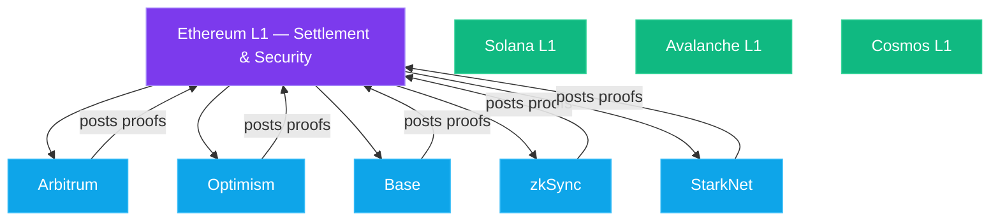

One of the first questions people ask when they start exploring crypto is: "Which blockchain is *the* blockchain?" It's a reasonable question. We have one internet, one TCP/IP protocol, one HTTP standard. Surely there'll be one blockchain that wins and the rest will fade away, right?

Nope. Not even close.

There are hundreds of active blockchains today, and that number is growing. This isn't a bug — it's a feature. Different chains make different tradeoffs, and those tradeoffs matter depending on what you're trying to do. A chain optimized for high-frequency trading looks nothing like one optimized for storing land records.

In this part, we're going to untangle the multi-chain world. Layer 1s, Layer 2s, rollups, app-chains, bridges — by the end, you'll understand why this zoo of chains exists and how they all fit together.

## The Blockchain Trilemma: Pick Two

Before we look at specific chains, you need to understand *why* there are so many. It comes down to a concept called the **[blockchain trilemma](https://vitalik.eth.limo/general/2021/04/07/sharding.html)**, popularized by Ethereum co-founder Vitalik Buterin.

Every blockchain tries to achieve three things:

- **Decentralization** — lots of independent nodes running the network, so no single entity controls it
- **Security** — extremely hard to attack, manipulate, or shut down
- **Scalability** — can process lots of transactions quickly and cheaply

Here's the catch: **you can only optimize for two out of three.** It's like the old project management joke — fast, cheap, or good: pick two.

- **Ethereum** prioritizes decentralization and security. Result? It's slow and expensive during high demand.
- **[Solana](https://solana.com/)** prioritizes security and scalability. Result? Fewer validators, meaning it's more centralized (and has had several outages).
- **BNB Chain** prioritizes scalability and security. Result? Only 21 validators — basically a corporate blockchain wearing a decentralization costume.

None of these are "wrong." They're just different tradeoffs for different use cases. And that's exactly why we have a multi-chain world.

## Layer 1s: The Foundation Chains

A **Layer 1** (L1) is a standalone blockchain with its own consensus mechanism, its own validators, and its own security. Think of L1s as independent countries — each with its own laws, currency, and infrastructure.

We covered Bitcoin and Ethereum in earlier parts. Here are some other major L1s worth knowing:

### Avalanche (Subnets)

Avalanche takes an interesting approach: instead of forcing everyone onto one chain, it lets developers create **subnets** — essentially custom blockchains that plug into the Avalanche ecosystem. A gaming company can spin up a subnet optimized for gaming. A bank can create a private subnet with compliance rules baked in.

Think of it like franchise restaurants. They all share the Avalanche brand and infrastructure, but each location can customize its menu.

### [Cosmos](https://cosmos.network/) (The Internet of Blockchains)

Cosmos doesn't even try to be one chain. Its whole philosophy is: "Every application should have its own blockchain." These are called **app-chains**, and they communicate with each other through a protocol called **[IBC](https://ibcprotocol.dev/)** (Inter-Blockchain Communication).

If Avalanche is a franchise, Cosmos is more like the European Union — sovereign nations that agreed on shared trade protocols so goods (tokens) can flow freely between them.

### [Polkadot](https://polkadot.com/) (Parachains)

Polkadot uses a central **Relay Chain** that provides shared security to connected chains called **parachains**. Each parachain can be customized for a specific purpose, but they all benefit from the Relay Chain's security.

Think of it as an airport hub. Each parachain is like a terminal with its own airlines and destinations, but they all share the same air traffic control and runway system.

### BNB Chain

Built by Binance, the world's largest crypto exchange. BNB Chain is fast and cheap, but achieves this by being quite centralized — only 21 validators, all essentially approved by Binance. It's popular for DeFi and gaming because transactions cost fractions of a cent.

> **Real talk:** BNB Chain is perfectly fine for experimenting and small transactions. Just understand that "decentralized" is doing some heavy lifting when 21 Binance-approved nodes run the whole show.

## Layer 2s: Building on Top of Ethereum

Here's where things get really interesting. Instead of building a whole new blockchain from scratch, what if you could build *on top of* an existing secure chain?

That's exactly what **Layer 2s** (L2s) do. They process transactions off Ethereum's main chain (which is slow and expensive), but periodically post proof of those transactions back to Ethereum. This means they **inherit Ethereum's security** while being much faster and cheaper.

Imagine Ethereum is a busy courthouse. Every transaction is a legal case that needs to go through the full court process — expensive and slow. Layer 2s are like arbitration services. They handle the disputes quickly and cheaply, but the final ruling is still backed by the authority of the courthouse.

You can track L2 ecosystem health, TVL, and risk assessments on [L2Beat](https://l2beat.com/scaling/summary) — the go-to dashboard for Layer 2 data.

There are two main flavors of L2 rollups:

### Optimistic Rollups: Trust, But Verify

Optimistic rollups **assume transactions are valid** (hence "optimistic") and only check them if someone raises a challenge. There's a **challenge period** — usually about 7 days — during which anyone can say "Hey, that transaction was fraudulent!" and prove it.

The major optimistic rollups:

- **[Arbitrum](https://arbitrum.io/)** — The biggest L2 by total value locked. Huge DeFi ecosystem. If you're using DeFi on a budget, you're probably on Arbitrum.
- **[Optimism](https://www.optimism.io/)** — Pioneer of the optimistic rollup design. Runs the "[Superchain](https://www.optimism.io/superchain)" vision where multiple chains share its technology.
- **[Base](https://base.org/)** — Built by Coinbase using Optimism's technology. It's become the go-to chain for consumer apps, onboarding millions of users who may not even realize they're using crypto infrastructure.

> **Tip:** When you withdraw from an optimistic rollup back to Ethereum, that 7-day challenge period applies to you. Your funds will be locked for about a week. Plan accordingly, or use a third-party bridge for faster (but slightly more expensive) exits.

### ZK Rollups: Prove It Mathematically

ZK (Zero-Knowledge) rollups take a different approach. Instead of assuming everything is fine and waiting for challenges, they generate a **mathematical proof** that every transaction in a batch is valid. This proof is then posted to Ethereum.

It's like the difference between an exam where the teacher spot-checks random answers (optimistic) versus one where you show all your work and the teacher can verify it instantly (ZK).

The major ZK rollups:

- **[zkSync](https://zksync.io/)** — One of the earliest ZK rollups to launch. Focuses on low fees and developer tooling.
- **[StarkNet](https://www.starknet.io/)** — Uses a different type of proof called STARKs (vs. SNARKs used by others). More complex but potentially more future-proof and doesn't require a trusted setup ceremony.
- **[Scroll](https://scroll.io/)** — Aims to be the most Ethereum-compatible ZK rollup, making it easy for developers to port existing Ethereum apps.

**So which is better — Optimistic or ZK?**

Right now, optimistic rollups are more mature and have bigger ecosystems. But most people in the industry believe ZK rollups are the long-term winner because the math is more elegant — no challenge periods, instant finality, and potentially better privacy features. The tech is just harder to build, so it's taking longer to mature.

## App-Chains: Your Own Personal Blockchain

Sometimes a project has such specific needs that even a general-purpose L2 isn't good enough. Enter **app-chains**: blockchains built for a single application.

The best example is **Hyperliquid**, a perpetual futures exchange that built its own Layer 1 blockchain from scratch. Why? Because a trading platform needs sub-second latency and custom order matching logic that general-purpose chains can't provide. By controlling the entire chain, Hyperliquid can optimize every millisecond.

Other examples include **dYdX** (which moved from Ethereum to its own Cosmos app-chain) and various gaming projects that need cheap, fast transactions without competing with DeFi traders for block space.

Think of app-chains like private roads. Public highways (general-purpose chains) work great for most people, but if you're Amazon and you're running thousands of delivery trucks, it might make sense to build your own logistics network.

## Bridges: Moving Between Worlds

With all these different chains, you need a way to move assets between them. That's what **bridges** do. Want to move your ETH from Ethereum to Arbitrum? You use a bridge. Want to move USDC from Ethereum to Avalanche? Bridge.

Here's how a basic bridge works:

1. You deposit tokens into a smart contract on Chain A
2. The bridge protocol verifies your deposit
3. Equivalent tokens are minted or released on Chain B
4. You now have your assets on the new chain

Simple in theory. Terrifying in practice.

> ⚠️ **Warning:** Bridges are the single biggest point of failure in the multi-chain world. Over **$2.5 billion** has been stolen from bridge hacks. The [Ronin bridge hack](https://rekt.news/ronin-rekt/) alone lost $624 million. The [Wormhole hack](https://rekt.news/wormhole-rekt/): $326 million. The [Nomad hack](https://rekt.news/nomad-rekt/): $190 million.

Why are bridges so risky? Because they're essentially giant honeypots. A bridge holds millions (sometimes billions) of dollars in locked assets, and if a hacker can trick the bridge into releasing those funds, it's game over. You're also trusting the bridge's validators or smart contracts to be bulletproof — and history says they often aren't.

**Practical advice:**

- Use official bridges when possible (Arbitrum Bridge, Optimism Bridge, etc.)
- For cross-chain moves, consider going through a major exchange instead — deposit on Chain A, withdraw on Chain B
- Don't leave large amounts sitting in bridge contracts
- Stick to well-audited bridges with long track records

## Chain Abstraction: The Future

Here's the honest truth: normal people should *never have to think about which chain they're on.* The fact that you need to manually switch networks, bridge assets, and pay different gas tokens on different chains is a terrible user experience.

**Chain abstraction** is the industry's answer. The idea is to build a layer of smart infrastructure that handles all the multi-chain complexity behind the scenes. You just say "I want to swap this token" or "I want to buy this NFT," and the system figures out the optimal chain, bridges your assets, and executes the transaction — all in one click.

Projects working on this include:

- **Particle Network** — universal accounts that work across chains
- **Socket / Bungee** — aggregates bridges and DEXs across chains
- **Near's chain signatures** — control accounts on any chain from one Near account
- **[ERC-4337](https://eips.ethereum.org/EIPS/eip-4337) (Account Abstraction)** — not chain abstraction exactly, but a building block that makes smart wallets possible

We're not fully there yet, but it's getting closer. Base is a great example of partial success — millions of people use apps built on Base without ever knowing (or caring) that they're on an Ethereum L2.

The endgame looks a lot like the internet today. You don't think about which server hosts a website, which CDN delivers the images, or which DNS provider resolves the domain. You just type a URL and it works. Blockchains will get there too.

## Pulling It All Together

Let's zoom out. Here's the multi-chain landscape in one mental model:

- **Layer 1s** (Ethereum, Solana, Avalanche, Cosmos chains) = Independent countries with their own rules and security
- **Layer 2s** (Arbitrum, Optimism, Base, zkSync) = States/provinces within a country (Ethereum), sharing its security but running their own operations
- **App-chains** (Hyperliquid, dYdX) = Private corporate campuses with their own infrastructure, connected to the broader world
- **Bridges** = International airports and border crossings — necessary but occasionally dangerous
- **Chain abstraction** = The future passport-free travel zone where borders become invisible

There will never be "one chain to rule them all," and that's okay. The internet isn't one server. The financial system isn't one bank. A multi-chain world is the natural outcome of different needs requiring different solutions.

The key is making all these chains work together so seamlessly that users never have to think about it. We're heading there, one bridge and one rollup at a time.

## What's Next?

We've talked about the infrastructure — the chains, the layers, the connections. But what actually *lives* on these chains? In **[Part 7](/blog/crypto-unlocked-07-tokens-and-standards)**, we'll dive into **tokens and token standards** — what ERC-20, ERC-721, and ERC-1155 actually mean, how tokens are created, and why not all tokens are created equal. If you've ever wondered what makes a "shitcoin" different from a "legit" token (technically speaking), that one's for you.

← [Previous: Solana — Speed at Scale](/blog/crypto-unlocked-05-solana-speed-at-scale) · [Series Index](/blog/series/crypto-unlocked) · [Next: Tokens & Standards](/blog/crypto-unlocked-07-tokens-and-standards) →

