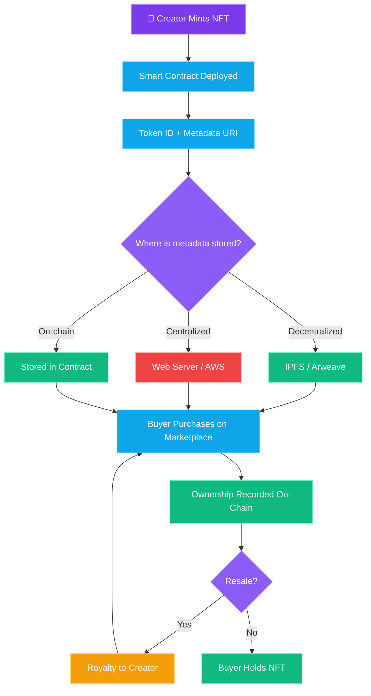

In March 2021, a digital artist named Mike Winkelmann — better known as Beeple — sold a single JPEG file at [Christie's auction house](https://www.christies.com/features/monumental-collage-by-beeple-is-first-purely-digital-artwork-nft-to-come-to-auction-11510-7.aspx) for **$69.3 million**. The art world lost its mind. Twitter lost its mind. Your uncle who barely uses email suddenly had opinions about blockchain. And just like that, three letters entered the global vocabulary: NFT.

Two years later, the floor prices of most NFT collections had collapsed over 90%. People were holding digital apes worth less than the gas fees they paid to mint them. The obituaries were written. "NFTs are dead," declared approximately everyone.

So... are they? Not even close. But to understand why, you need to look past the JPEGs.

## What Does "Non-Fungible" Actually Mean?

Let's start with the word nobody can pronounce at dinner parties.

**Fungible** means interchangeable. A dollar bill is fungible — your $20 bill works exactly the same as my $20 bill. We can swap them and neither of us cares. Bitcoin is fungible too (mostly). One BTC equals one BTC.

**Non-fungible** means unique. Your house is non-fungible. Even if your neighbor's house has the same floor plan, yours has that weird stain on the ceiling and a slightly bigger garden. They're not interchangeable. Your concert ticket for Row A, Seat 12 is not the same as Row Z, Seat 47, even though they're for the same show.

An **NFT (Non-Fungible Token)** is simply a unique digital record on a blockchain that proves you own a specific thing. That "thing" could be an image, a music file, a game item, a domain name, a deed to property, or a ticket to an event. The token itself doesn't *contain* the thing — it's more like a certificate of authenticity that points to it.

> **Key insight:** NFTs aren't a type of art. They're a type of *ownership*. The art bubble was just the first (loudest) application.

## How NFTs Work Under the Hood

In [Part 7](/blog/crypto-unlocked-07-tokens-and-standards), we covered ERC-20 — the standard for fungible tokens where every unit is identical. NFTs use different standards:

- **[ERC-721](https://eips.ethereum.org/EIPS/eip-721):** The original NFT standard on Ethereum. Every token has a unique ID. One token = one specific item. This is what CryptoPunks, Bored Apes, and most "1-of-1" art collections use.

- **[ERC-1155](https://eips.ethereum.org/EIPS/eip-1155):** A multi-token standard that supports *both* fungible and non-fungible tokens in a single contract. Perfect for gaming — you might have 1,000 identical health potions (fungible) and one legendary sword (non-fungible) managed by the same smart contract. More gas-efficient for batch operations.

- **SPL Tokens on Solana:** Solana doesn't separate fungible and non-fungible standards the way Ethereum does. Instead, an NFT is simply an SPL token with a supply of exactly one and zero decimal places. The [Metaplex](https://www.metaplex.com/) protocol adds the metadata layer on top. Different architecture, same concept.

### The Metadata Problem

Here's the dirty secret of NFTs that most people don't talk about.

When you "own" an NFT, you own a token on the blockchain that contains a token ID and a pointer — usually a URL — to the actual content. The image of your ape? That's almost certainly *not* stored on-chain (storing images on Ethereum would cost thousands of dollars in gas).

Instead, most NFTs point to off-chain storage:

- **[IPFS](https://ipfs.tech/) (InterPlanetary File System):** A decentralized file network where content is addressed by its hash. As long as at least one node pins the file, it stays available. Decent, but not bulletproof — if nobody pins it, it disappears.
- **[Arweave](https://www.arweave.org/):** Permanent storage where you pay once and data is stored forever (theoretically). More reliable, but more expensive upfront.
- **Regular web servers:** Some NFTs literally point to a company's AWS bucket. If the company goes bankrupt or the server shuts down? Congratulations, you own a token that points to a 404 page.

> **Warning:** Before buying any NFT, check where the metadata lives. If it's on a regular web server, your "permanent digital ownership" is only as permanent as someone paying the hosting bill.

A small number of projects store everything on-chain (like [Art Blocks](https://www.artblocks.io/) generative art, which stores the code to regenerate the artwork directly on Ethereum). These are genuinely permanent but rare.

## The 2021 Boom: Digital Gold Rush

To understand NFTs today, you have to understand what happened in 2021. It was a perfect storm:

- **Beeple's $69.3M sale** at Christie's legitimized NFTs overnight. Traditional art world meets crypto — front page everywhere.
- **[CryptoPunks](https://cryptopunks.app/)** — 10,000 pixel-art characters originally given away for free in 2017 — started selling for millions. Visa bought one. Jay-Z used one as his profile picture. (Now owned by [Yuga Labs](https://yuga.com/), which acquired the IP from Larva Labs in 2022.)
- **[Bored Ape Yacht Club](https://boredapeyachtclub.com/)** (BAYC) launched on April 30, 2021 at 0.08 ETH (~$190) per ape — selling out in 12 hours. By early 2022, floor prices hit 100+ ETH (~$300,000+). Celebrities from Justin Bieber to Snoop Dogg bought in. The "club" aspect — exclusive Discord access, commercial rights to your ape — added a layer of community and identity. By 2024, floor prices had dropped roughly 90% from their peak.
- **NBA Top Shot**, **Axie Infinity**, **Art Blocks** — the space exploded in every direction. Monthly NFT trading volume hit $5 billion+ in January 2022.

Money was flowing. FOMO was raging. Everyone with a Photoshop license launched a collection. Most were derivative garbage. But hey, number go up.

## The Crash: 90% Down and Then Some

What goes up in a speculative frenzy must come down. And it came down *hard*.

By 2023, the vast majority of NFT collections had lost 90-95% of their peak value. Many went to zero. [A study by dappGambl](https://dappgambl.com/nfts/dead-nfts/) estimated that over 95% of NFT collections had effectively zero market value. OpenSea's monthly volume dropped from billions to tens of millions.

What happened? Everything you'd expect:

- **Oversupply:** Tens of thousands of collections flooded the market. Most had no utility, no community, no reason to exist.
- **Speculation unwind:** People weren't buying art — they were buying lottery tickets. When the music stopped, there weren't enough chairs.
- **Macro environment:** Rising interest rates killed speculative assets across the board. Crypto winter didn't spare NFTs.
- **Wash trading:** A significant portion of NFT volume turned out to be fake — people trading with themselves to inflate prices and farm marketplace token airdrops.

> **Reality check:** The crash didn't prove NFTs are useless. It proved that *speculating on profile pictures* is not a business model. The technology underneath survived just fine.

## NFT Marketplaces: The Royalty Wars

Where you buy and sell NFTs matters — and the marketplace landscape has been a bloodbath.

- **[OpenSea](https://opensea.io/):** The original dominant marketplace. Founded in 2017, it rode the 2021 wave to a [$13.3 billion valuation in January 2022](https://techcrunch.com/2022/01/04/opensea-raises-300-million-at-13-3-billion-valuation/). But it got complacent and slow to innovate — daily volume cratered 99% from its May 2022 peak by late that year.
- **[Blur](https://blur.io/):** Launched in October 2022 and ate OpenSea's lunch almost overnight. Blur targeted pro traders with faster execution, zero fees, and an aggressive token airdrop campaign. By early 2023, it had overtaken OpenSea in volume.
- **[Magic Eden](https://magiceden.io/):** Started as the top Solana marketplace, then expanded to Ethereum, Bitcoin Ordinals, and other chains. Now one of the biggest cross-chain NFT platforms.
- **[Tensor](https://tensor.trade/):** Solana's pro-trading NFT platform, essentially the Blur of Solana. Fast, data-rich, and popular with active traders.

The real drama? **Royalties.** Originally, NFT creators earned a percentage (typically 5-10%) every time their work resold — a revolutionary concept for artists. But Blur and others made royalties optional to attract traders. OpenSea was forced to follow. Creators lost a massive revenue stream, and the debate still rages: should on-chain royalties be enforceable, or is the market right to reject them?

It's a genuine tension. Enforced royalties are great for creators but can feel like a tax to traders. The market voted with its wallets, and creators mostly lost.

## Real Use Cases Beyond Art

Here's where NFTs get interesting again. Forget the monkeys. The technology — a verifiable, unique digital token proving ownership — is genuinely useful for a lot of things:

### 🎮 Gaming

Imagine actually *owning* your in-game items instead of renting them from a game company that can ban your account or shut down servers.

- **[Immutable X](https://www.immutable.com/):** An Ethereum layer-2 built specifically for gaming NFTs. Zero gas fees for trading. Powers games like **[Gods Unchained](https://godsunchained.com/)** (a trading card game where you actually own your cards) and **[Illuvium](https://illuvium.io/)**.
- **[Ronin](https://roninchain.com/):** The chain behind Axie Infinity. Despite a [$620 million hack in March 2022](https://www.bbc.com/news/technology-60933174) — attributed to North Korea's Lazarus Group — the gaming ecosystem continues to develop.
- The promise: you buy a sword in one game, use it in another, sell it when you're done. We're not there yet, but the infrastructure is being built.

### 🎵 Music

Artists have been screwed by the music industry forever. NFTs offer a way to sell directly to fans without Spotify taking 70%.

- Platforms like **Sound.xyz** pioneered music NFTs — letting fans buy limited editions of songs, earning bragging rights and sometimes royalties. The music NFT space continues to evolve with new platforms and models.
- The real potential: artists retaining ownership and building direct economic relationships with their audience. No label, no distributor, no 15% cut for the streaming platform.

### 🎫 Ticketing

Paper tickets get counterfeited. Digital tickets get scalped. NFT tickets solve both problems.

- **[GET Protocol](https://onopen.xyz/)** (now the OPEN Ticketing Ecosystem): Has processed millions of NFT tickets for real events. The ticket is an NFT — verifiable, non-duplicable, and programmable. The artist can even earn a cut of resale.
- Every major ticketing company is exploring this. [Ticketmaster has experimented](https://business.ticketmaster.com/) with token-gated experiences. It's a matter of when, not if.

### 🌐 Domain Names

- **[ENS (Ethereum Name Service)](https://ens.domains/):** Turns your wallet address (0x7a3B...4f2e) into something human-readable like `yourname.eth`. These are NFTs you own and control — with millions of names registered to date. Vitalik Buterin uses `vitalik.eth`.
- **[Unstoppable Domains](https://unstoppabledomains.com/):** Similar concept with `.crypto`, `.nft`, `.wallet` domains. No renewal fees — buy once, own forever.

### 🏠 Real Estate

Tokenizing property ownership as NFTs enables fractional ownership — buying 1% of an apartment building instead of the whole thing. Still early, and regulatory hurdles are massive, but experiments are happening in multiple jurisdictions.

### 🪪 Identity & Credentials

- **Soulbound Tokens (SBTs):** Non-transferable NFTs that represent credentials, achievements, or identity attributes. Your university degree as an SBT — verifiable on-chain, can't be faked, can't be sold to someone else.
- **POAPs (Proof of Attendance Protocol):** NFTs that prove you were at an event, attended a conference, or participated in a community moment. Digital collectible badges that actually verify presence.

## PFP Culture: When JPEGs Became Identity

One phenomenon worth understanding: **PFP (Profile Picture) culture**. During 2021-2022, your NFT *was* your digital identity. Having a CryptoPunk or Bored Ape as your Twitter avatar signaled membership in a tribe — wealth, early adoption, community belonging.

This sounds absurd until you realize people already do this with fashion. A Rolex, a Supreme hoodie, a vintage car — they're all identity signals. PFP NFTs were the digital-native version. Your Bored Ape said "I was early, I'm part of this club, I have skin in the game."

The cultural moment faded with the prices, but the *concept* of blockchain-verified digital identity hasn't. It's just looking for its next form.

## Why NFTs Still Matter

Let me be blunt: most NFTs were (and are) worthless. The 2021 mania was driven by speculation, hype, and greater-fool economics. If you bought a random collection hoping it'd be the next BAYC, you probably lost money. That's the honest truth.

But the *technology* — unique digital ownership verified by a public blockchain — is not going away. Consider:

- **Digital property rights are inevitable.** As more of our lives happen online, we'll need verifiable ownership of digital goods. NFTs are the best mechanism we have.
- **The internet lacks a native ownership layer.** You can copy a JPEG, sure. But you can't copy the blockchain record that proves who bought it, who owns it, and its entire transaction history. That distinction matters more as digital goods get more valuable.
- **Creator monetization is broken.** Artists, musicians, game developers — they all get squeezed by platforms and intermediaries. NFTs offer a path (imperfect, still developing) to direct creator-to-consumer economics.
- **Interoperability.** An NFT isn't locked to one platform. Your ENS name works across wallets, dApps, and services. Your game item could (theoretically) move between games. This composability is uniquely enabled by open blockchain standards.

The bubble popped. Good. Bubbles always pop. But the railroads built during the railroad bubble still carried trains afterward. The websites launched during the dot-com bubble still served pages. And the ownership infrastructure built during the NFT bubble will still verify ownership when the next wave of real applications arrives.

> **My take:** We're in the "trough of disillusionment" for NFTs. The hype tourists left. What remains are builders creating actual utility. That's where the real story begins.

## What's Next

We've covered what you can *own* on a blockchain — coins, tokens, and now unique digital assets. But what can you *do* with them? In **[Part 9: DeFi Fundamentals](/blog/crypto-unlocked-09-defi-fundamentals)**, we're diving into the world of Decentralized Finance — lending, borrowing, trading, and earning yield, all without a bank, a broker, or a permission slip. This is where crypto starts replacing actual financial infrastructure.

Let's go.

← [Previous: Tokens & Standards](/blog/crypto-unlocked-07-tokens-and-standards) · [Series Index](/blog/series/crypto-unlocked) · [Next: DeFi Fundamentals](/blog/crypto-unlocked-09-defi-fundamentals) →

