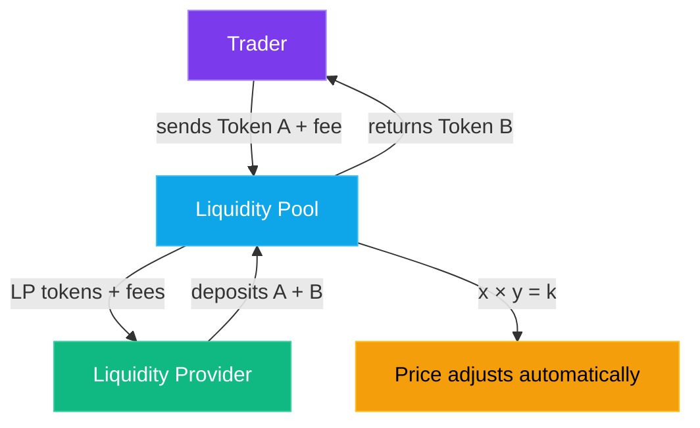

What if I told you there's a type of exchange that runs 24/7, never asks for your ID, can't freeze your funds, has no CEO, no employees, and does billions of dollars in daily volume — all powered by a math formula that fits on a napkin?

Welcome to the world of decentralized exchanges. This is where DeFi gets *really* interesting.

## The Old Way: Order Books

To understand why DEXs are revolutionary, you need to understand what they replaced.

Traditional exchanges — whether it's the NYSE or [Binance](https://www.binance.com/) — use **[order books](https://www.investopedia.com/terms/o/order-book.asp)**. Think of it like a marketplace noticeboard:

- **Buyers** post what they want to buy and at what price ("I'll buy 1 ETH for $3,000")
- **Sellers** post what they want to sell ("I'll sell 1 ETH for $3,010")
- When a buyer's price meets a seller's price, a trade happens

This works great... when you have millions of traders creating a thick, liquid market. But what if you want to trade some obscure token at 3 AM? There might be nobody on the other side of your trade. The order book is thin, spreads are wide, and you're stuck.

More importantly, order books need someone to *run* the matching engine. That someone is a centralized company. With your money. And your data.

## The New Way: Automated Market Makers

In November 2018, a former mechanical engineer named Hayden Adams launched **[Uniswap](https://uniswap.org/)** and changed everything — inspired by a [blog post by Vitalik Buterin](https://vitalik.eth.limo/general/2017/06/22/marketmakers.html) on automated market makers. Instead of matching buyers with sellers, Uniswap introduced the **Automated Market Maker (AMM)** — a smart contract that *is* the market.

Here's the core idea: instead of an order book, you have a **liquidity pool**. It's a smart contract holding a pile of two tokens. Anyone can trade against that pile, and a simple math formula determines the price.

That formula? **x × y = k** (the [constant product formula](https://docs.uniswap.org/contracts/v2/concepts/protocol-overview/glossary#constant-product-formula))

That's it. That's the revolution.

Let me break it down:

- **x** = the amount of Token A in the pool
- **y** = the amount of Token B in the pool
- **k** = a constant (the product of x and y must always stay the same)

Say a pool has 10 ETH and 30,000 USDC. That means k = 300,000. If you want to buy ETH, you add USDC to the pool and remove ETH — but the product must remain 300,000. The math automatically adjusts the price based on how much is in the pool.

> **The simple version:** The more of a token people buy from the pool, the more expensive it gets. The more they sell into the pool, the cheaper it gets. Supply and demand, enforced by math.

No company. No employees. No downtime. Just a smart contract doing multiplication. (In practice, Uniswap applies a [0.30% fee](https://docs.uniswap.org/contracts/v2/concepts/protocol-overview/how-uniswap-works) to each trade which slightly increases *k* over time — that's how LPs get paid.)

## How Prices Actually Work

Let's trace through a real example. Our pool has:

- **10 ETH** and **30,000 USDC** (k = 300,000)
- The implied price of ETH is 30,000 ÷ 10 = **$3,000**

You want to buy 1 ETH. You need to add enough USDC so that after removing 1 ETH, the constant holds:

- After your trade: 9 ETH × ? USDC = 300,000
- ? = 33,333 USDC
- You need to add 33,333 - 30,000 = **3,333 USDC** for 1 ETH

Wait — that's $3,333, not $3,000! The price moved *during your trade*. That's because you're buying a significant chunk of the pool (10% of all the ETH). This price impact is called **slippage**, and it's more noticeable in smaller pools or with larger trades.

> **💡 This is why big pools matter.** A pool with 10,000 ETH and 30,000,000 USDC would barely budge on a 1 ETH trade. More liquidity = less slippage = better prices for traders.

## Becoming the House: Liquidity Providers

So who puts the tokens in the pool? **Liquidity Providers (LPs)** — regular people like you and me.

Here's the deal: you deposit an equal value of two tokens into a pool. In return, you earn a cut of every single trade that happens in that pool. On [Uniswap v2](https://docs.uniswap.org/contracts/v2/overview), that's a flat 0.3% of each swap, distributed proportionally to all LPs. (Uniswap v3 and v4 offer [multiple fee tiers](https://docs.uniswap.org/concepts/protocol/fees) — 0.01%, 0.05%, 0.3%, and 1% — so pools can match their fee to the pair's volatility.)

Think of it like owning a tiny piece of a currency exchange booth at the airport. Every time someone swaps euros for dollars, you get a slice. You're literally *being the house*.

When you deposit tokens, you receive **LP tokens** (sometimes called "receipt tokens") that represent your share of the pool. These are like a claim ticket. Want your tokens back? Burn the LP tokens and withdraw your share — including any fees you've earned.

> **🧾 LP tokens are real tokens** — you can hold them, transfer them, and in many DeFi protocols, stake them for additional rewards. This is where "yield farming" comes from (more on that in Part 10).

## The Catch: Impermanent Loss

Here's the part nobody talks about until it's too late. **[Impermanent loss](https://www.youtube.com/watch?v=8XJ1MSTEuU0)** is the single most important concept for anyone thinking about providing liquidity.

Let me explain with a simple example:

**Scenario:** You provide liquidity to an ETH/USDC pool when ETH is $3,000. You deposit 1 ETH + 3,000 USDC (total value: $6,000).

**What happens next:** ETH goes to $4,000. Great news, right?

**If you had just held:** 1 ETH ($4,000) + 3,000 USDC = **$7,000**

**What you actually have in the pool:** Due to the constant product formula, arbitrage traders have rebalanced your position. You now have roughly 0.866 ETH + 3,464 USDC = **$6,928**

**Your impermanent loss:** $7,000 - $6,928 = **$72** (about 1%)

You still made money compared to your initial $6,000 — but you made *less* than if you'd just held the tokens in your wallet. The pool constantly rebalances your holdings, selling your winners and buying your losers.

It's called "impermanent" because if ETH goes back to $3,000, the loss disappears. But if you withdraw while prices have diverged, the loss becomes very permanent.

> **⚠️ The rule of thumb:** Impermanent loss hurts most when the two tokens in your pair diverge significantly in price. Pairs of correlated assets (like USDC/USDT or wETH/stETH) have much lower impermanent loss.

The question every LP needs to answer: **Do the trading fees I earn outweigh my impermanent loss?** Sometimes yes, sometimes very much no. (Tools like [dailydefi.org's IL calculator](https://dailydefi.org/tools/impermanent-loss-calculator/) can help you model different scenarios before you commit.)

## Concentrated Liquidity: The Uniswap v3 Upgrade

Classic AMMs spread your liquidity across all possible prices — from $0 to infinity. That's wildly inefficient. Most of your capital sits in price ranges that will never be used. (Uniswap's own data showed the v2 DAI/USDC pair utilized only [~0.50% of its capital](https://docs.uniswap.org/concepts/protocol/concentrated-liquidity) for trades in the $0.99–$1.01 range where virtually all volume occurred.)

**[Uniswap v3](https://docs.uniswap.org/concepts/protocol/concentrated-liquidity)** introduced **concentrated liquidity**: you choose the price range where you want to provide liquidity.

For example, instead of covering ETH from $0 to $∞, you could say: "I'll provide liquidity for ETH between $2,500 and $3,500." Your capital is now concentrated in that range, earning *way* more fees per dollar deployed.

The tradeoff? If the price moves outside your range, your position stops earning fees entirely and you're left holding 100% of the less valuable token. It's more capital efficient but requires active management. (Note: [Uniswap v4](https://docs.uniswap.org/contracts/v4/overview), launched in January 2025, keeps concentrated liquidity but adds a "hooks" system that lets developers customize pool behavior — auto-rebalancing, dynamic fees, and more.)

> **Think of it like this:** Classic AMM = a fishing net spread across the entire ocean. Concentrated liquidity = fishing where the fish actually are. More efficient, but you need to know where to cast.

## Providing Liquidity: A Step-by-Step Walkthrough

Here's what it actually looks like to become an LP:

1. **Choose your DEX** — [Uniswap](https://app.uniswap.org/) (Ethereum), [Raydium](https://raydium.io/) (Solana), [PancakeSwap](https://pancakeswap.finance/) (BNB Chain), etc.
2. **Connect your wallet** — MetaMask, Phantom, whatever fits your chain
3. **Pick a pool** — Usually sorted by trading volume and fee tier
4. **Deposit tokens** — You need equal *value* of both tokens (not equal amounts). If ETH is $3,000, you'd deposit 1 ETH + 3,000 USDC
5. **Set your price range** (if using v3-style concentrated liquidity) — Tighter range = more fees but higher risk of going out of range
6. **Confirm the transaction** — Pay gas, sign, done
7. **Receive LP tokens** — These represent your pool share
8. **Monitor and collect fees** — Some protocols auto-compound, others require manual claiming

> **🔰 Start small.** Try a stablecoin pair first (USDC/USDT). Minimal impermanent loss, and you'll learn the mechanics without the stress of volatile assets moving against you.

## Slippage: Why Your Trade Price Isn't What You Expected

We touched on this earlier, but it deserves its own callout. **Slippage** is the difference between the price you expect and the price you actually get.

In an AMM, every trade moves the price. Small trades in big pools? Barely any slippage. But:

- **Big trade + small pool** = significant slippage
- **Volatile market + pending transaction** = price moves before your trade executes

Most DEX interfaces let you set a **slippage tolerance** — say 0.5% or 1%. If the price moves more than that before your transaction confirms, the trade fails instead of giving you a bad deal.

> **⚠️ Be careful with high slippage tolerance.** Setting it to 10%+ is an invitation for MEV bots to sandwich your trade (buying before you and selling after, pocketing the difference). Keep it as tight as you can.

## The Major AMMs You Should Know

The AMM landscape is massive and multi-chain. Here are the ones that matter:

- **[Uniswap](https://uniswap.org/)** — The OG. Ethereum mainnet + L2s (Arbitrum, Optimism, Base). The gold standard
- **[Curve Finance](https://curve.fi/)** — Specialized in stablecoin and pegged-asset swaps. Uses a modified bonding curve ([StableSwap invariant](https://curve.fi/whitepaper)) for extremely low slippage on similar-value tokens
- **[PancakeSwap](https://pancakeswap.finance/)** — The biggest DEX on BNB Chain. Lower fees, sometimes shadier tokens
- **[Raydium](https://raydium.io/)** — Leading AMM on Solana. Fast, cheap, integrated with [OpenBook](https://www.openbook-solana.com/)'s on-chain order book (the community successor to Serum after FTX's collapse)
- **[Orca](https://www.orca.so/)** — Another Solana favorite. Clean UX, concentrated liquidity via "Whirlpools"
- **[Aerodrome](https://aerodrome.finance/)** — The dominant DEX on Base (Coinbase's L2). A Velodrome fork that's become the liquidity hub for the Base ecosystem

Each chain tends to have a dominant DEX. When you're on that chain, that's usually where you'll find the deepest liquidity and best prices.

## Why This Matters

DEXs and AMMs aren't just "decentralized Binance." They're something fundamentally new — permissionless financial infrastructure that anyone can build on, contribute to, or earn from.

You can:
- **Trade** any token the moment someone creates a pool for it (no listing process)
- **Earn** passive income by providing liquidity
- **Build** applications on top of existing pools
- **Participate** in governance of these protocols

The combination of AMMs, LP tokens, and composability is what makes DeFi a financial Lego set. And we've only scratched the surface.

## What's Next

In **Part 10**, we're going deeper into the DeFi rabbit hole. We'll cover **lending and borrowing protocols** (Aave, Compound), **yield farming strategies**, **flash loans** (borrowing millions with no collateral — seriously), and how all these DeFi Legos snap together to create increasingly complex (and sometimes absurdly risky) financial products.

If this part made you feel like the house, next part will show you how the house can also be the bank, the insurance company, and the hedge fund — all at once.

See you there. 🏊‍♂️
