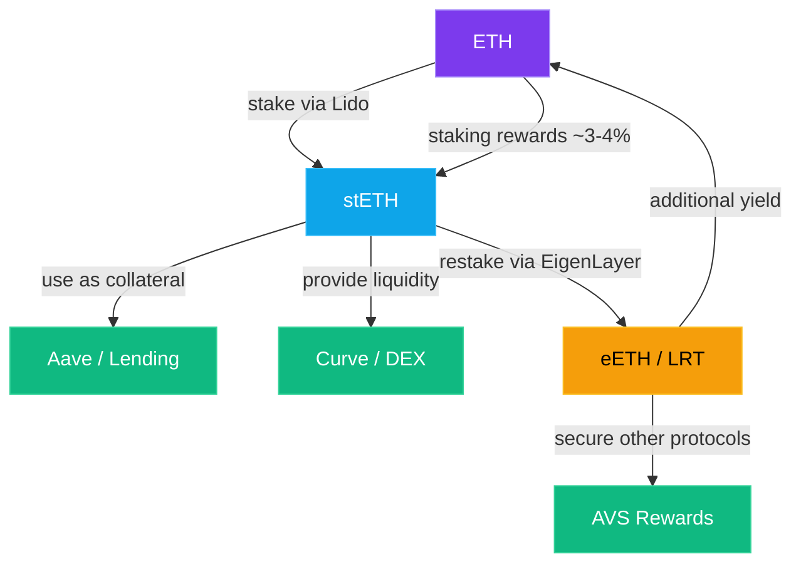

Welcome to the deep end of the pool.

In [Part 9](/blog/crypto-unlocked-09-dexs-liquidity-pools), you learned the fundamentals — swapping tokens, providing liquidity, and lending. That was DeFi 101. Now we're going further. Yield farming, liquid staking, restaking, auto-compounding vaults, governance wars, and the uncomfortable question every DeFi participant eventually has to face: *is this real yield, or am I the exit liquidity?*

This is where DeFi gets both incredibly powerful and incredibly dangerous. Let's dig in.

## Yield Farming: The Great APY Hunt

Yield farming is exactly what it sounds like — you're a farmer, except instead of growing crops, you're growing returns by moving your capital across DeFi protocols to wherever the yield is highest.

Here's how it typically works:

1. You deposit tokens into a protocol (a lending pool, a liquidity pool, a vault)
2. The protocol rewards you with its own governance token on top of any natural yield
3. You sell that token for more of what you deposited
4. Repeat

Simple, right? In the 2020 "[DeFi Summer](https://www.coindesk.com/learn/what-is-defi/)," kicked off when [Compound Finance](https://compound.finance/) started distributing its COMP governance token to users in June 2020. Suddenly, people were earning **thousands of percent APY** by providing liquidity and lending. New protocols would launch, offer insane token rewards to attract liquidity, and farmers would pile in, harvest the rewards, dump the token, and move on to the next farm.

> **💡 Key term:** APY (Annual Percentage Yield) includes compounding. APR (Annual Percentage Rate) doesn't. A 100% APR compounded daily is actually ~171% APY. Always check which one a protocol is showing you — some use APY to make numbers look bigger.

## Liquidity Mining: Getting Paid to Provide Liquidity

Liquidity mining is a specific type of yield farming where a protocol pays you extra tokens for providing liquidity to its pools. It was the rocket fuel of DeFi's growth.

Think of it like a new restaurant offering free meals to its first 100 customers. The restaurant (protocol) needs people in the seats (liquidity in the pools) to function, so it subsidizes them with rewards. Early customers get a great deal. But once the free meals stop... do people keep coming back?

That's the billion-dollar question.

**The yield farming meta** — deposit → earn token → sell token → repeat — has a fundamental problem: if everyone is farming a token just to sell it, who's buying? The protocol is essentially paying for liquidity with inflation. When the rewards dry up, the liquidity leaves, the token drops, and latecomers are left holding the bag.

This doesn't mean all yield farming is bad. It means you need to understand *where the yield comes from*.

## Real Yield vs. Emissions: The Most Important Question in DeFi

This is the single most important concept in this entire article. Maybe in all of DeFi. Every time you see an attractive APY, ask yourself one question:

**Where does the money come from?**

There are only two answers:

- **Real yield:** The protocol generates actual revenue from fees, and shares that revenue with token holders or liquidity providers. The money comes from users paying for a service.
- **Emissions:** The protocol prints its own token and hands it out as rewards. The money comes from... nowhere. It's inflation dressed up as yield.

Here's how to spot the difference:

- **Source** — Real Yield: Trading fees, interest, liquidations · Emissions: Newly minted protocol tokens
- **Sustainable?** — Real Yield: Yes, if users keep using the protocol · Emissions: No, eventually rewards must decrease
- **Examples** — Real Yield: GMX (fee sharing), Aave (interest income) · Emissions: Most farm tokens in 2020-2021
- **Red flag** — Real Yield: Low but steady APY (5-20%) · Emissions: Sky-high APY (500%+) that drops fast

**[GMX](https://gmx.io/)** is the poster child of real yield. It's a decentralized perpetual exchange. Traders pay fees to trade. Those fees get distributed to GMX stakers and liquidity providers. The yield comes from actual economic activity — people trading.

**[Aave](https://aave.com/)** generates real yield from borrowers paying interest. If you lend USDC on Aave, your interest comes from borrowers. That's real. Sustainable. Boring, even. And boring is good.

> **🔑 Rule of thumb:** If a protocol can't explain where the yield comes from without mentioning its own token, be very skeptical. Real businesses generate revenue. Ponzi schemes generate tokens.

## Liquid Staking: Have Your Cake and Eat It Too

Remember staking from earlier in this series? You lock up your ETH (or SOL, or other proof-of-stake tokens) to help secure the network, and you earn rewards. The problem? Your capital is locked. You can't do anything else with it.

Liquid staking solves this elegantly.

When you stake ETH through **[Lido](https://lido.fi/)**, you receive **stETH** (staked ETH) — a token that represents your staked ETH plus the staking rewards it's accumulating. You still earn the ~3-4% staking yield, but now you can *also* use stETH in DeFi:

- Use stETH as collateral to borrow on Aave
- Provide stETH liquidity on Curve
- Deposit stETH in a vault for extra yield

It's like getting a receipt for your deposit at the bank, except that receipt is itself money you can spend and invest.

Other major liquid staking protocols:
- **[Rocket Pool](https://rocketpool.net/) (rETH)** — more decentralized than Lido, anyone can run a node
- **[Jito](https://www.jito.network/) (jitoSOL)** — liquid staking for Solana, with MEV rewards baked in
- **[Marinade](https://marinade.finance/) (mSOL)** — another popular Solana liquid staking option

> **⚠️ Risk alert:** Liquid staking tokens should trade at roughly 1:1 with the underlying asset, but they can depeg during market stress. In June 2022, stETH traded at a ~5% discount to ETH as panic sellers dumped it. If you're borrowing against your liquid staking token, a depeg can trigger liquidation.

## Restaking: Staking Your Staked ETH (Yes, Really)

Just when you thought stacking yield couldn't get any more recursive, along came **[EigenLayer](https://app.eigenlayer.xyz/)** with restaking.

Here's the idea: your staked ETH (via stETH or native staking) is already securing Ethereum. EigenLayer lets you *restake* that same ETH to simultaneously secure other protocols and services — oracles, bridges, data availability layers — earning additional rewards on top of your staking yield.

Think of it as your security deposit for an apartment also being used to guarantee your gym membership. Same capital, multiple jobs, multiple rewards.

The ecosystem that's grown around this is wild:
- **[EigenLayer](https://docs.eigenlayer.xyz/)** — the restaking protocol itself
- **Liquid restaking tokens (LRTs)** — tokens like eETH (from [EtherFi](https://www.ether.fi/)) or pufETH (from [Puffer](https://www.puffer.fi/)) that represent your restaked position
- **AVSs (Actively Validated Services)** — the protocols being secured by restaked ETH

It's yield on yield on yield. And yes, it also means risk on risk on risk. Each layer adds smart contract risk, slashing risk (your ETH can be penalized if an AVS misbehaves), and complexity risk. The matryoshka doll of DeFi.

## Vaults and Auto-Compounders: Set It and Forget It

Not everyone wants to manually harvest rewards, swap tokens, and redeposit every day. That's where vaults come in.

**[Yearn Finance](https://yearn.fi/)** pioneered the concept: you deposit tokens into a vault, and Yearn's strategies automatically farm the best yields, compound your returns, and optimize gas costs by batching transactions across all vault users.

**[Beefy Finance](https://beefy.com/)** does something similar across multiple blockchains — Ethereum, Polygon, Arbitrum, BSC, you name it.

The value proposition is simple:
- **Without a vault:** You deposit into a farm, manually claim rewards every few days, swap them back, redeposit, pay gas each time
- **With a vault:** You deposit once. The vault does everything automatically. Your position grows over time.

Vaults charge a fee (usually a percentage of the yield), but for most people, the convenience and compounding efficiency more than makes up for it.

> **💡 Pro tip:** Vaults are great for "set and forget" DeFi. But always check what strategy a vault is using under the hood. You're trusting the vault developers to write secure, profitable strategies. A bug in a vault strategy can drain everyone's funds.

## The Curve Wars: Game Theory Meets DeFi Governance

This one's a rabbit hole within a rabbit hole, but it's one of the most fascinating episodes in DeFi history.

**[Curve Finance](https://curve.fi/)** is a DEX optimized for stablecoins and similar assets. It has its own token, CRV. If you lock your CRV tokens for up to 4 years, you get **veCRV** (vote-escrowed CRV), which lets you vote on which liquidity pools get the highest CRV rewards.

Here's where it gets spicy: if you're a protocol and you want people to provide liquidity for *your* token on Curve, you want those CRV rewards directed to your pool. So protocols started **bribing** veCRV holders to vote for their pools.

Then **[Convex Finance](https://www.convexfinance.com/)** entered the chat. Convex aggregates CRV from many users, locks it all as veCRV, and lets Convex token holders (vlCVX) control those votes. Suddenly, controlling Convex meant controlling Curve's reward emissions — which meant controlling where billions of dollars in liquidity flowed.

Protocols were spending millions to acquire CVX tokens. It became a full-on arms race — the "Curve Wars."

This is **veTokenomics** in action: lock tokens → get governance power → direct rewards → create economic incentives. It's game theory, politics, and finance all mashed together. DeFi at its most creative and chaotic.

## Ponzinomics: When Yield Is Too Good to Be True

Let's talk about the elephant in the room. Not all DeFi yield is created equal, and some of it is straight-up unsustainable. Here are the red flags:

**🚩 Unsustainable APYs**
If a protocol is offering 10,000% APY, ask yourself: what business on Earth generates that kind of return? The answer is none. The yield is coming from new depositors' money or token inflation. That's a ticking time bomb.

**🚩 OHM forks (3,3) mania**
In late 2021, **OlympusDAO** popularized the (3,3) meme — the idea that if everyone stakes and nobody sells, everyone wins. Dozens of copycat protocols launched on every chain, each promising even higher staking APYs. Most went to zero within weeks. The game theory only works when new money keeps entering. When it stops, the music stops.

**🚩 Anchor Protocol**
The most devastating example. [Anchor Protocol](https://en.wikipedia.org/wiki/Terra_(blockchain)), on the Terra/Luna blockchain, offered a "stable" ~19.5% yield on UST (an algorithmic stablecoin). Billions of dollars poured in. Where did the yield come from? Mostly from reserves that were being steadily depleted. When the reserves ran out and confidence wavered in May 2022, UST depegged, Luna hyperinflated, and [**~$45 billion in market cap was wiped out**](https://en.wikipedia.org/wiki/Terra_(blockchain)) in a single week. People lost their life savings. Terraform Labs later [filed for bankruptcy](https://www.reuters.com/technology/terraform-labs-files-chapter-11-bankruptcy-protection-2024-01-22/) in January 2024.

> **⚠️ The golden rule:** If you can't explain where the yield comes from in one sentence using real-world economics, don't put your money in it. "Revenue from trading fees" is a real answer. "Staking rewards from the protocol token" is a circular answer.

## Risk Management: Surviving the DeFi Jungle

Advanced DeFi is high-risk by nature. Here's how to manage it:

- **Diversify across protocols.** Don't put everything in one vault, one chain, or one strategy. Smart contract hacks happen.
- **Understand smart contract risk.** Every protocol you interact with is a potential point of failure. Has the code been audited? By whom? How long has it been running without issues?
- **Watch for oracle risk.** Many DeFi protocols depend on price feeds (oracles). If the oracle gets manipulated or goes down, liquidations can cascade.
- **Size your positions.** DeFi yield farming should be "money you can afford to lose" territory. Not your emergency fund. Not your rent money.
- **Stay updated.** Follow protocol governance proposals. A governance vote can change tokenomics, fee structures, or risk parameters overnight.
- **Use established protocols.** There's a reason "battle-tested" is a compliment in DeFi. Aave, Compound, Curve, and Uniswap have survived multiple market cycles. The new fork-of-a-fork launched last Tuesday? Maybe give it a few months.

> **🔑 Remember:** In DeFi, you are your own risk manager. There's no FDIC insurance, no customer support hotline, no bailout. The yields can be spectacular precisely *because* the risks are real.

## The Bottom Line

Advanced DeFi is the financial frontier — equal parts innovation and chaos. Yield farming can be profitable if you understand the mechanics. Liquid staking and restaking are genuinely useful innovations that improve capital efficiency. Vaults make complex strategies accessible. And the Curve Wars showed that DeFi governance can be as strategic and competitive as any traditional market.

But for every GMX generating real fees, there's an OHM fork promising 80,000% APY before collapsing to zero. The difference between building wealth and getting wrecked in DeFi comes down to one thing: understanding where the yield comes from.

If you take away one thing from this article, let it be this: **real yield comes from real revenue.** Everything else is musical chairs.

## What's Next

We've been exploring DeFi — the decentralized side of crypto trading and finance. But the reality is, most people's first crypto experience is on a centralized exchange like Coinbase or Binance. In **[Part 11](/blog/crypto-unlocked-11-cexs-vs-dexs)**, we'll compare **CEXs vs. DEXs** — centralized and decentralized exchanges. The trade-offs between convenience and control, custody and sovereignty. When should you use each, and what are the real risks of both? See you there.
---

← [Previous: DEXs & Liquidity Pools](/blog/crypto-unlocked-09-dexs-liquidity-pools) · [Series Index](/blog/series/crypto-unlocked) · [Next: CEXs vs DEXs](/blog/crypto-unlocked-11-cexs-vs-dexs) →
