In November 2022, [FTX](https://en.wikipedia.org/wiki/FTX_(company)) was the third-largest crypto exchange on the planet by volume. Superbowl ads, celebrity endorsements, a founder valued at an estimated $16 billion. Nine days — from the first [CoinDesk exposé on November 2nd](https://www.coindesk.com/business/2022/11/02/divisions-in-sam-bankman-frieds-crypto-empire-blur-on-his-trading-titan-alameda-balance-sheet/) to the bankruptcy filing on November 11th — and it was over. Billions in customer funds — gone. Not hacked. Not exploited by some anonymous attacker. Just... taken. By the people running the exchange.

```mermaid
graph TD
    A[👤 You] -->|create account & KYC| B[🏢 CEX]
    B -->|deposit funds| C[💼 Exchange Wallet]
    C -->|order book matching| D[📊 Trade Executes]
    D -->|funds stay on exchange| C
    C -->|you withdraw| E[🔑 Your Wallet]

    style A fill:#7c3aed,stroke:#a78bfa,color:#fff
    style B fill:#ef4444,stroke:#f87171,color:#fff
    style C fill:#f59e0b,stroke:#fbbf24,color:#000
    style D fill:#0ea5e9,stroke:#38bdf8,color:#fff
    style E fill:#10b981,stroke:#34d399,color:#fff
```

```mermaid
graph TD
    A[👤 You] -->|connect wallet| B[🔗 Smart Contract]
    B -->|swap via liquidity pool| C[🏊 AMM Pool]
    C -->|tokens return instantly| D[🔑 Your Wallet]
    A -.->|you keep your keys| D

    style A fill:#7c3aed,stroke:#a78bfa,color:#fff
    style B fill:#10b981,stroke:#34d399,color:#fff
    style C fill:#0ea5e9,stroke:#38bdf8,color:#fff
    style D fill:#10b981,stroke:#34d399,color:#fff
```

If you ever needed a reason to understand the difference between centralized and decentralized exchanges, that's it.

## What Is a Centralized Exchange?

A centralized exchange (CEX) is basically a bank for crypto. You create an account, verify your identity, deposit money, and trade. [Binance](https://www.binance.com/), [Coinbase](https://www.coinbase.com/), [Kraken](https://www.kraken.com/) — these are all centralized exchanges.

The "centralized" part means there's a company running the show. They match buyers with sellers. They hold your funds in their wallets. They decide which tokens get listed and which don't. They comply with regulations, freeze accounts when told to, and can lock you out if they want.

Sound familiar? It should. It works exactly like your regular brokerage or bank — just with crypto instead of stocks or euros.

And honestly? For most people getting started, that's fine. CEXs are popular for good reasons:

- **Fiat on-ramps** — You can deposit euros or dollars directly from your bank account. This is still the easiest way to turn "normal" money into crypto.
- **Simple interfaces** — Coinbase especially is designed for people who've never touched crypto. Buy Bitcoin in three clicks.
- **Customer support** — Something goes wrong? There's someone to email (whether they actually respond quickly is another story).
- **Liquidity** — Major CEXs handle billions in daily volume. Your trades execute instantly at tight spreads.
- **Advanced tools** — Limit orders, stop losses, margin trading, futures. All the trading instruments professionals expect.

For buying your first Bitcoin or converting your paycheck into crypto, a CEX is genuinely the path of least resistance.

## The Custody Tradeoff

Here's the catch, and it's a big one: when your crypto sits on a centralized exchange, it's not really yours.

Remember the golden rule from earlier in this series? **Not your keys, not your coins.** When you deposit crypto on Coinbase, you're handing them your private keys. Your account balance is just a number in their database — an IOU. You're trusting that when you hit "withdraw," they'll actually send you the crypto.

That trust is the entire foundation. And most of the time, it works. But "most of the time" isn't "always."

Exchanges can:
- **Freeze your account** for compliance reasons (or sometimes no clear reason at all)
- **Get hacked** — [Mt. Gox in 2014](https://en.wikipedia.org/wiki/Mt._Gox) lost 850,000 Bitcoin. Gone.
- **Go bankrupt** — taking your funds with them
- **Misuse your deposits** — lending them out, gambling with them, or worse

Which brings us to the elephant in the room.

## The FTX Collapse: A Masterclass in Counterparty Risk

FTX wasn't some shady back-alley exchange. It was endorsed by Tom Brady. It had its name on an NBA arena. Institutional investors — including [Sequoia Capital](https://en.wikipedia.org/wiki/Sequoia_Capital) and SoftBank — poured billions into it. It was "the responsible one" — the exchange that talked about regulation and compliance.

Behind the scenes, FTX was funneling customer deposits to its sister company [Alameda Research](https://en.wikipedia.org/wiki/Alameda_Research), which was using the money for risky trades and personal expenses. When the market turned and customers tried to withdraw, the money simply wasn't there.

```mermaid
graph TD
    A[📰 Nov 2 — CoinDesk exposé reveals<br/>Alameda's FTT-heavy balance sheet] -->|panic begins| B[🔥 Nov 6 — Binance CEO CZ<br/>announces selling all FTT holdings]
    B -->|bank run| C[🏃 Nov 7-8 — $6B in withdrawals<br/>in 72 hours, FTX halts withdrawals]
    C -->|rescue attempt| D[🤝 Nov 8 — Binance signs LOI<br/>to acquire FTX]
    D -->|due diligence| E[❌ Nov 9 — Binance walks away<br/>citing mishandled funds]
    E -->|collapse| F[💀 Nov 11 — FTX files for<br/>Chapter 11 bankruptcy]
    F -->|aftermath| G[⚖️ Nov 2023 — SBF convicted<br/>on all 7 fraud counts]

    style A fill:#f59e0b,stroke:#fbbf24,color:#000
    style B fill:#ef4444,stroke:#f87171,color:#fff
    style C fill:#ef4444,stroke:#f87171,color:#fff
    style D fill:#0ea5e9,stroke:#38bdf8,color:#fff
    style E fill:#ef4444,stroke:#f87171,color:#fff
    style F fill:#7c3aed,stroke:#a78bfa,color:#fff
    style G fill:#10b981,stroke:#34d399,color:#fff
```

$8 billion in customer funds. Vanished. Federal prosecutors later called it ["one of the biggest financial frauds in American history."](https://www.justice.gov/usao-sdny/pr/united-states-attorney-announces-charges-against-ftx-founder-samuel-bankman-fried) In November 2023, [Sam Bankman-Fried was convicted](https://www.nytimes.com/2023/11/02/technology/sam-bankman-fried-fraud-trial-ftx.html) on all seven criminal counts of fraud and conspiracy.

> **The lesson:** Counterparty risk is real. When you trust a third party with your money, you're exposed to everything they do with it — including things they'll never tell you about.

The FTX collapse didn't happen because of a smart contract bug or a blockchain failure. It happened because humans had custody of other people's money and chose to abuse that trust. The blockchain worked perfectly fine. The centralized institution built on top of it didn't.

## Proof of Reserves: Trust, but Verify?

After FTX imploded, surviving exchanges scrambled to prove they weren't doing the same thing. The result: **[Proof of Reserves (PoR)](https://niccarter.info/proof-of-reserves/)**.

The idea is simple — an exchange publishes cryptographic proof that they hold enough assets to cover all customer deposits. Some use Merkle trees (a data structure that lets you verify your account is included without revealing everyone else's). Others hire third-party auditors.

It's a step in the right direction, but it's not bulletproof:

- **Snapshot problem** — PoR shows assets at one point in time. An exchange could borrow funds for the snapshot and return them the next day.
- **Liabilities aren't always included** — Proving you *have* assets doesn't prove you don't *owe* more than you have.
- **Auditor quality varies** — Some "audits" are barely more than a press release.

Proof of Reserves is better than blind trust. But it's still trust. You're trusting the methodology, the auditor, and the exchange's honesty about their liabilities.

You know what requires zero trust? A decentralized exchange.

## What Is a DEX?

A decentralized exchange (DEX) is a platform where you trade crypto directly with other people — no company in the middle. No accounts. No identity verification. No one holding your funds.

Instead of a company matching orders, a DEX runs on smart contracts — code deployed on a blockchain that executes trades automatically. You connect your wallet, approve a transaction, and the swap happens on-chain. Your crypto goes directly from your wallet to the other person's wallet (or to a liquidity pool — more on that in a second).

Popular DEXs include [Uniswap](https://uniswap.org/) (Ethereum), [PancakeSwap](https://pancakeswap.finance/) (BNB Chain), and [Jupiter](https://jup.ag/) (Solana). You can track DEX volume across all chains on [DefiLlama](https://defillama.com/dexs).

The key difference: **you never give up custody of your funds.** Your crypto stays in your wallet until the exact moment a trade executes. There's no deposit step. There's no balance on someone else's server. There's no FTX scenario possible because there's no FTX.

## Order Book DEXs vs AMM DEXs

Not all DEXs work the same way. There are two main flavors:

### Order Book DEXs

These work like traditional exchanges — buyers post bids, sellers post asks, and the system matches them. The difference is the order book lives on-chain (or in a hybrid on/off-chain setup).

Examples: [dYdX](https://dydx.exchange/), Serum (now [OpenBook](https://openbookdex.com/) on Solana).

The advantage is precise pricing and familiar trading mechanics. The downside is that on-chain order books are expensive and slow on networks like Ethereum, which is why they tend to live on faster chains.

### AMM DEXs (Automated Market Makers)

This is where things get interesting — and where most of the DEX innovation has happened.

Instead of matching individual buyers and sellers, AMMs use **liquidity pools**. People deposit pairs of tokens into a pool (say, ETH and USDC), and a mathematical formula automatically determines the price based on the ratio of tokens in the pool.

When you trade on Uniswap, you're not trading with another person. You're trading with a pool of tokens, and the price adjusts based on supply and demand within that pool.

It sounds weird, but it works remarkably well. AMMs solved the chicken-and-egg problem that killed earlier DEX attempts — you don't need a buyer for every seller. You just need liquidity in the pool.

> **Think of it like this:** An order book exchange is like a farmers' market where buyers and sellers haggle directly. An AMM is like a vending machine — the price is set by a formula, and it adjusts automatically based on what's left inside.

## The UX Gap

Let's be honest: using a DEX for the first time is harder than using Coinbase.

On a CEX, you sign up with an email, deposit money, and click "Buy." On a DEX, you need to:

1. Already have a self-custody wallet ([MetaMask](https://metamask.io/), [Phantom](https://phantom.app/), etc.)
2. Already have crypto in that wallet to trade with (and to pay gas fees)
3. Understand which network you're on
4. Approve token spending permissions
5. Watch out for slippage, front-running, and MEV
6. Accept that there's no customer support if you send tokens to the wrong address

The gap is shrinking — wallet UX is improving, and DEX aggregators like [1inch](https://1inch.io/) find you the best prices automatically. But we're not at "grandma can use it" territory yet.

For total beginners, CEXs remain the on-ramp. And that's okay. You can start with a CEX and graduate to DEXs as you get comfortable.

## KYC, Privacy, and Access

Here's another fundamental difference that matters more than you'd think.

**CEXs require KYC (Know Your Customer).** Before you can trade, you submit your ID, proof of address, sometimes even a selfie. This is a regulatory requirement — anti-money laundering (AML) laws mandate it in most countries.

That means:
- Your identity is linked to your trading activity
- The exchange can (and will) share data with tax authorities
- People in certain countries may be blocked entirely
- Your account can be frozen based on government requests

**DEXs are permissionless.** No account. No ID. No restrictions based on nationality. You connect a wallet and trade. Nobody can freeze your wallet or block your access to the smart contract.

This isn't about "hiding something." For billions of people worldwide, permissionless access is the only option. If you live in a country with a broken banking system, capital controls, or authoritarian oversight, a DEX might be the only way you can participate in the global financial system.

> **Important:** Permissionless doesn't mean regulation-free. Tax obligations still apply to you personally, even when using DEXs. The blockchain is public — every trade you make is recorded and visible forever. DEXs give you access; they don't give you invisibility.

## When to Use What

This isn't an either/or decision. Smart crypto users use both:

**Use a CEX when:**
- Buying crypto with fiat (bank transfer, card)
- You want simple UI and customer support
- Trading high-volume pairs with tight spreads
- You need advanced order types (stops, limits)
- You're just getting started

**Use a DEX when:**
- Trading tokens not listed on CEXs
- You want to maintain self-custody
- Participating in DeFi (yield farming, LPs)
- You value privacy and permissionless access
- You don't trust third parties with your funds

The pragmatic approach: **use a CEX as an on-ramp** (convert fiat to crypto), then **transfer to your own wallet** and use DEXs for everything else. Best of both worlds.

## The Hybrid Future

The industry is converging. Both sides are borrowing from each other:

- **CEXs are adding Proof of Reserves** and on-chain transparency
- **DEXs are improving UX** with better interfaces, gasless transactions, and fiat on-ramps
- **Hybrid models** are emerging — platforms that offer CEX-like simplicity with non-custodial wallets under the hood
- **[Account abstraction](https://eips.ethereum.org/EIPS/eip-4337)** (ERC-4337 and beyond) is blurring the line between custodial and self-custody, making wallet management invisible to users

We're heading toward a world where the average user won't even know — or care — whether they're using a CEX or a DEX. The trade will just work, and custody will default to self-custody without requiring a PhD in key management.

But we're not there yet. So for now, understanding the tradeoffs matters.

## The Bottom Line

Centralized exchanges are convenient. They're the front door to crypto for most people, and they serve that role well. But every time you leave funds on a CEX, you're trusting a company with your money — and history has shown that trust can be catastrophically misplaced.

Decentralized exchanges remove that trust entirely. They're harder to use, sometimes more expensive, and can't help you if you make a mistake. But nobody can take your funds, freeze your account, or gamble with your deposits.

The FTX collapse wasn't a crypto failure. It was a centralization failure. The blockchain did exactly what it was designed to do. The humans running the exchange didn't.

**Not your keys, not your coins.** It's not just a slogan. It's a survival strategy.

## What's Next

Now that you understand the CEX vs DEX landscape, we're going to go deep on the decentralized side. In **[Part 13](/blog/crypto-unlocked-13-spot-dexs)**, we'll explore **spot DEXs** in detail — how AMMs actually work under the hood, what liquidity pools really are, how to evaluate a DEX, and how to make your first swap without getting wrecked by slippage or MEV bots. See you there.

← [Previous: Advanced DeFi](/blog/crypto-unlocked-11-advanced-defi) · [Series Index](/blog/series/crypto-unlocked) · [Next: Spot DEXs](/blog/crypto-unlocked-13-spot-dexs) →

