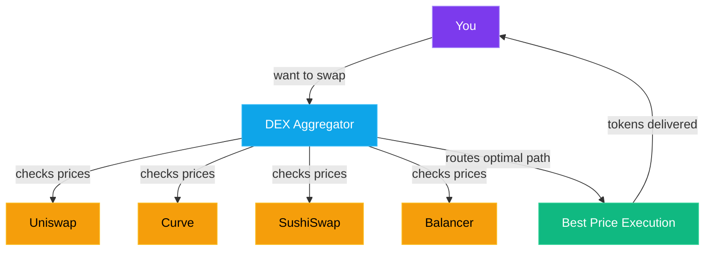

You wouldn't show up to a construction site with just your bare hands. You'd bring tools — a drill, a level, maybe a thermos of coffee to keep you sane. DeFi is the same. The protocols we've covered in previous parts are the raw materials. Now let's talk about the **tools** that make working with them faster, cheaper, and a whole lot safer.

This chapter is your DeFi toolbox. Bookmark it. You'll come back to it.

## DEX Aggregators: Your Best Friend for Swaps

Remember how we talked about decentralized exchanges in [Part 10](/blog/crypto-unlocked-10-dexs-liquidity-pools)? Uniswap, SushiSwap, Curve — each has its own liquidity pools with slightly different prices. If you swap directly on one DEX, you might get a worse rate than what's available elsewhere.

A **DEX aggregator** checks dozens of DEXs simultaneously and routes your trade through whichever path gets you the best price. Think of it like a flight comparison site — instead of checking every airline individually, you search once and get the cheapest option.

The big names:

- **[1inch](https://1inch.io)** — The OG aggregator on Ethereum and many EVM chains. Splits trades across multiple DEXs for optimal pricing.
- **[Jupiter](https://jup.ag)** — The king of Solana. If you're swapping anything on Solana, Jupiter is where you go. Period.
- **[CowSwap](https://swap.cow.fi)** — Uses a unique "batch auction" model that groups trades together. This gives you MEV protection built-in (more on MEV soon — it's important).
- **ParaSwap** — Another strong EVM aggregator with competitive rates and a clean interface.

> **Pro tip:** Always use an aggregator instead of going directly to a single DEX. The price difference can be 0.5–2% on larger trades. That's free money you're leaving on the table otherwise.

## Bridges: Crossing the Chain Divide

You've got ETH on Ethereum but want to use a dApp on Arbitrum. Or you have SOL but need USDC on Base. That's where **bridges** come in — they move your assets from one blockchain to another.

Popular bridges include:

- **Across** — Fast and cheap, especially for Ethereum L2s. Uses an optimistic model with relayers that front you the funds.
- **Stargate** — Built on [LayerZero](https://layerzero.network)'s messaging protocol. Supports a wide range of chains with unified liquidity pools.
- **[Wormhole](https://wormhole.com)** — Connects a massive number of chains including Solana, Ethereum, and Cosmos ecosystems.
- **[LayerZero](https://layerzero.network)** — More of an infrastructure layer. Many bridges and apps build on top of it. You'll interact with it indirectly through apps like Stargate.

### Bridge Risks: The Elephant in the Room

I'm not going to sugarcoat this: bridges are one of the riskiest parts of crypto. They've been responsible for some of the biggest hacks in history:

- **Ronin Bridge (2022):** $625 million stolen. Attackers compromised validator keys for the bridge connecting Axie Infinity's sidechain. The hack went unnoticed for *six days*.
- **Wormhole (2022):** $320 million lost due to a smart contract vulnerability. An attacker minted wrapped ETH on Solana without actually depositing ETH on Ethereum.

Why are bridges so vulnerable? Because they're essentially a giant vault sitting between two chains, and they need some mechanism to verify that a deposit on Chain A actually happened before releasing funds on Chain B. That verification layer is the attack surface.

> **How to minimize bridge risk:**
> - Use well-established bridges with strong track records
> - Don't bridge more than you need at once
> - Check if the destination chain has native on-ramps (sometimes it's cheaper and safer to just buy directly)
> - Wait for transactions to fully confirm before assuming the bridge worked
> - Newer "intent-based" bridges like Across tend to have smaller attack surfaces because there's no giant pool to drain

## Portfolio Trackers: Your DeFi Dashboard

Once you're active across multiple chains and protocols, keeping track of everything becomes... a lot. You've got tokens in a wallet on Ethereum, an LP position on Arbitrum, some staked assets on Solana, and maybe a few NFTs you forgot about.

Portfolio trackers aggregate all of it into a single dashboard:

- **[DeBank](https://debank.com)** — Excellent for seeing your full DeFi portfolio across EVM chains. Shows every protocol position, token balance, and even your transaction history. The social features are a nice bonus.
- **[Zapper](https://zapper.xyz)** — Clean interface, supports a huge range of protocols. Great for discovering new DeFi opportunities and tracking your net worth over time.
- **Zerion** — Similar to Zapper with a polished mobile app. Also functions as a wallet.

Just connect your wallet address (read-only — no signing required) and you instantly see everything you own across every chain. It's like Mint or YNAB, but for DeFi.

## Block Explorers: Reading the Blockchain

Every transaction on a blockchain is public. Block explorers are the tools that make that data human-readable.

- **[Etherscan](https://etherscan.io)** — The gold standard for Ethereum. Look up any wallet, transaction, or smart contract. Verify contracts, check gas costs, see token transfers. If you're on Ethereum, you'll use Etherscan constantly. Each L2 has its own variant too — Arbiscan for Arbitrum, Basescan for Base, etc.
- **Solscan** — Same concept for Solana. Clean interface that shows transaction details, token accounts, and program interactions.

> **Tip:** Whenever a transaction feels "off" — you got less tokens than expected, gas was weirdly high, or something just doesn't look right — paste the transaction hash into the block explorer. It tells you *exactly* what happened, down to every token transfer and contract call. Learn to read block explorers. It's like learning to read your bank statement, except it's actually transparent.

## MEV: The Invisible Tax You're Already Paying

This is one of the most important topics in DeFi that most beginners have never heard of. **MEV** stands for **Maximal Extractable Value** (originally "Miner Extractable Value"), and it's the profit that can be extracted by reordering, inserting, or censoring transactions within a block.

Here's the simple version: when you submit a swap on a DEX, your transaction sits in a public waiting area called the **mempool** before it gets included in a block. Bots can *see* your pending transaction and exploit it.

The most common attack is the **sandwich attack:**

1. You submit a trade to buy Token X.
2. A bot sees your pending transaction and quickly buys Token X *before* you (frontrunning), pushing the price up.
3. Your trade executes at the now-higher price.
4. The bot immediately sells Token X *after* you (backrunning), pocketing the difference.

You end up paying more than you should have, and the bot walks away with the profit. This happens thousands of times per day. You won't even notice — your trade still goes through, just at a slightly worse price.

### MEV Protection: Fighting Back

The good news? You can protect yourself:

- **[Flashbots Protect](https://www.flashbots.net)** — Instead of sending your transaction to the public mempool, Flashbots routes it through a private channel directly to block builders. Bots can't see what they can't find. Just add the Flashbots RPC to your wallet and your Ethereum transactions become invisible to sandwich bots.
- **[MEV Blocker](https://mevblocker.io)** — Similar concept, backed by CoW Protocol. Sends transactions privately and even gives you a *rebate* if your transaction generates MEV — meaning you get paid instead of the bot.
- **Private mempools** — Many L2s like Arbitrum process transactions in a sequencer that doesn't have a traditional public mempool, reducing MEV by design.

> **My strong opinion:** If you're swapping on Ethereum mainnet, use Flashbots Protect or MEV Blocker. There's literally no downside. You're just opting out of being exploited.

## Intent-Based Trading: The Next Evolution

Traditional DEX trading works like this: you craft a specific transaction ("swap exactly 1 ETH for USDC on Uniswap V3 at this pool"). You specify *how* the trade happens.

**Intent-based** trading flips this: you just state *what* you want ("I want to sell 1 ETH for the best possible amount of USDC") and let specialized solvers compete to fill your order in the best way possible.

- **[CowSwap](https://swap.cow.fi)** — Pioneered this model. Your trades are signed off-chain as "intents," then professional solvers batch them together and find optimal execution. Bonus: trades between CowSwap users can match directly (peer-to-peer) without touching a DEX at all, saving you gas and eliminating MEV.
- **UniswapX** — Uniswap's intent-based system. Dutch auctions where fillers compete to give you the best price. If no one fills your order, it falls back to on-chain execution.

Intent-based trading is still relatively new, but it's clearly the direction things are heading. Better prices, gas savings, and built-in MEV protection — hard to argue with that.

## Analytics: Data-Driven Decisions

Want to know which protocols are actually growing? Where the real TVL is? Which chains are gaining users? These platforms turn raw blockchain data into actionable insights:

- **[DefiLlama](https://defillama.com)** — The best free dashboard for tracking Total Value Locked (TVL) across every protocol and chain. Want to compare Aave's TVL on Ethereum vs. Arbitrum? DefiLlama. Want to see which L2 is growing fastest? DefiLlama. Bookmark it.
- **[Dune Analytics](https://dune.com)** — Community-built dashboards using SQL queries on blockchain data. If you can think of a question, someone's probably already built a Dune dashboard for it. And if they haven't, you can build your own.
- **[Token Terminal](https://tokenterminal.com)** — Focuses on protocol *revenue* and financial metrics. Because TVL is vanity — revenue is sanity. Great for evaluating whether a protocol's token is actually capturing value.

## Gas Trackers and Optimization

Gas fees are the cost of doing business on-chain, but they fluctuate wildly. On Ethereum, a swap might cost $2 at 3 AM UTC and $30 during peak hours.

**Gas optimization basics:**

- **Time your transactions.** Use a gas tracker (Etherscan has one built in, or check ultrasound.money) to see current gas prices. Weekends and early mornings (UTC) tend to be cheapest.
- **Set reasonable gas limits.** Don't overpay by using wallet defaults on every transaction. Most wallets let you customize.
- **Use L2s for small transactions.** If you're swapping $100 worth of tokens, paying $15 in gas on mainnet Ethereum is absurd. Use Arbitrum, Base, or Optimism where gas costs pennies.
- **Batch transactions when possible.** Some protocols let you claim rewards and reinvest in a single transaction instead of two separate ones.

> **Reality check:** Gas optimization matters most on Ethereum mainnet. On Solana, gas is fractions of a cent. On L2s, it's usually under $0.10. Don't waste an hour optimizing a $0.03 fee — focus your energy on the chains where it actually makes a difference.

## Putting It All Together

Here's what a well-equipped DeFi toolkit looks like in practice:

1. **Find opportunities** — DefiLlama, Dune, Token Terminal
2. **Move assets** — Across, Stargate for bridging
3. **Execute trades** — Jupiter (Solana), 1inch or CowSwap (EVM) through aggregators
4. **Protect yourself** — Flashbots Protect or MEV Blocker enabled in your wallet
5. **Track everything** — DeBank or Zapper for portfolio overview
6. **Verify transactions** — Etherscan, Solscan when something looks off

None of these tools require you to deposit funds or give up custody. They're all interfaces to the same open, permissionless infrastructure. That's the beauty of DeFi — you can switch tools anytime, and your assets stay in your wallet.

## What's Next

We've covered how to trade, lend, provide liquidity, and now how to do all of it efficiently with the right tools. But crypto isn't just about finance.

In **[Part 17](/blog/crypto-unlocked-17-web3-ownership-internet)**, we'll explore the broader world of **Web3** — decentralized identity, social networks, gaming, and the applications being built on top of blockchain technology that have nothing to do with trading. The financial layer is just the beginning.

← [Previous: Options & Advanced Trading](/blog/crypto-unlocked-15-options-advanced-instruments) · [Series Index](/blog/series/crypto-unlocked) · [Next: Web3 — The Ownership Internet](/blog/crypto-unlocked-17-web3-ownership-internet) →

