You're staring at a tedious migration task—200 test files that need converting from Jest to Vitest. The patterns are clear. The work is mechanical. But it's going to take you all day.

Or you could type one command, grab lunch, and come back to find it done.

That's Ralph Wiggum. And once you've used it, you'll wonder how you ever worked without it.


## What is Claude Code?

Claude Code is Anthropic's official CLI for Claude—a terminal-based AI coding assistant that can read, write, and edit files in your codebase. Unlike chat interfaces, Claude Code works directly with your local files, runs commands, and integrates into your development workflow. For a complete introduction, see [Claude Code Mastery Part 1: Getting Started](/blog/claude-code-mastery-01-getting-started).

## What is Ralph Wiggum?

Ralph is a Claude Code plugin that turns your AI assistant into an autonomous coding agent. Instead of the usual back-and-forth—prompt, review, prompt, review—you give Ralph a task and walk away. It works until the job is actually done.

The philosophy is simple: **Iteration > Perfection**. Don't try to get it right on the first prompt. Let the loop handle it.

As [Geoffrey Huntley](https://github.com/ghuntley/how-to-ralph-wiggum), the technique's creator, puts it: "Ralph is a Bash loop." That's literally what it is—a `while true` that feeds Claude the same prompt until completion criteria are met.

Here's the mechanics:

1. You give Claude a task with clear completion criteria
2. Claude works on it and tries to exit when "done"
3. A Stop hook intercepts and checks: is it *actually* done? (Hooks are automated actions that run at specific points in Claude's lifecycle—see [Mastery Part 3](/blog/claude-code-mastery-03-project-configuration#hooks-automated-actions) for details)
4. If not, the same prompt gets fed back in
5. Claude sees its previous work in the files
6. The loop continues until genuine completion

**The key insight?** The prompt never changes—but the codebase does. Each iteration builds on the last. Claude reads its own previous work and improves on it.

```mermaid
graph LR
    A[📝 Prompt] --> B[⚙️ Work]
    B --> C{✓ Done?}
    C -->|No| B
    C -->|Yes| D[🎉 Complete]

    style A fill:#7c3aed,stroke:#5b21b6,color:#fff
    style B fill:#2563eb,stroke:#1d4ed8,color:#fff
    style C fill:#059669,stroke:#047857,color:#fff
    style D fill:#16a34a,stroke:#15803d,color:#fff
```



## Why This Matters

This isn't theoretical. Developers are running 14-hour autonomous sessions that migrate entire codebases. Geoffrey Huntley ran a 3-month loop that built a programming language. [VentureBeat called Ralph](https://venturebeat.com/technology/how-ralph-wiggum-went-from-the-simpsons-to-the-biggest-name-in-ai-right-now) "the biggest name in AI right now."

The plugin was formalized by [Boris Cherny](https://github.com/anthropics/claude-code/tree/main/plugins/ralph-wiggum), Anthropic's Head of Claude Code. It's official. It's production-ready. And it's changing how serious developers work.

## Getting Started (5 Minutes)

### Step 1: Install the Dependency

Ralph needs `jq` for JSON processing. Install it first:

```bash
# macOS
brew install jq

# Ubuntu/Debian
sudo apt-get install jq

# Windows: Use WSL or grab it from https://stedolan.github.io/jq/
```

### Step 2: Install the Plugin

Inside Claude Code, run `/plugin` to open the plugin discovery interface. Search for "ralph" and select `ralph-loop` from the official plugins.


Or install directly with:

```bash
/plugin install ralph-loop@claude-plugins-official
```

### Step 3: Configure Permissions

Here's what trips up most people: Ralph runs autonomously, which means it can't stop and ask you "is this okay?" for every file edit. If you don't configure permissions, the loop breaks the moment Claude hits a permission prompt.

**Option A: Pre-approve in settings (recommended)**

Add the tools Ralph needs to your `.claude/settings.local.json`:

```json
{
  "permissions": {
    "allow": [
      "Edit",
      "Write",
      "Bash(npm test:*)",
      "Bash(npm run build:*)",
      "Bash(git add:*)",
      "Bash(git commit:*)"
    ]
  }
}
```

> **Understanding permission syntax:** The `Bash(npm test:*)` pattern means "allow any Bash command starting with `npm test`". The `*` acts as a wildcard. This gives Ralph permission to run tests without prompting you each time. See [Mastery Part 3: Project Configuration](/blog/claude-code-mastery-03-project-configuration#the-permission-system) for full details on permission patterns.

**Option B: Use permission flags**

For long-running tasks in a sandboxed environment, you can bypass permission prompts entirely:

```bash
claude --dangerously-skip-permissions
# or
claude --permission-mode acceptEdits
```

> **Warning:** Only use `--dangerously-skip-permissions` in sandboxed environments (containers, VMs, disposable cloud instances). It gives Claude full access to your filesystem.

As [Boris Cherny notes](https://www.threads.com/@boris_cherny/post/DTBVuylEjqQ), for very long-running tasks you'll want either `--permission-mode=dontAsk` or `--dangerously-skip-permissions` in a sandbox so Claude isn't blocked waiting for you.

**Option C: Full Sandboxing (Recommended for Long-Running Tasks)**

For serious autonomous work, Claude Code's [built-in sandboxing](https://code.claude.com/docs/en/sandboxing) isolates Ralph while still allowing necessary operations. [JeredBlu's guide](https://github.com/JeredBlu/guides/blob/main/Ralph_Wiggum_Guide.md) provides a practical configuration—create `.claude/settings.json`:

```json
{
  "permissions": {
    "allow": [
      "WebFetch(domain:registry.npmjs.org)",
      "WebFetch(domain:github.com)"
    ],
    "deny": [
      "Bash(sudo *)",
      "Bash(docker *)",
      "Read(./.env)",
      "Read(~/.ssh/**)"
    ]
  },
  "sandbox": {
    "enabled": true,
    "autoAllowBashIfSandboxed": true,
    "allowUnsandboxedCommands": false
  }
}
```

Customize the allow/deny lists for your project's needs.

### Step 4: Run Your First Loop

Start small. Here's a safe first experiment:

```bash
/ralph-loop "Add JSDoc comments to all exported functions in src/utils.ts. Output <promise>DONE</promise> when complete." --completion-promise "DONE" --max-iterations 10
```

Watch it work. Review the commits. Get a feel for the rhythm.

## The Two Parameters That Matter

**`--max-iterations`** is your safety net. Always set it. The default is unlimited, which means Ralph will run forever if the completion promise never triggers.

> **Start small.** 10-20 iterations for your first few experiments. A 50-iteration loop on a large codebase can cost $50-100+ in API credits.

**`--completion-promise`** tells Ralph when to stop. It's exact string matching—Claude must output this precise text to signal completion.

```bash
/ralph-loop "<your task>" --max-iterations 30 --completion-promise "TASK COMPLETE"
```

## Plugin vs Bash Loop: Which to Use

There are two ways to run Ralph:

**Plugin Method (`/ralph-loop`)**
- Runs in a single context window
- Easier to set up
- Good for tasks under 20-30 iterations

**Bash Loop Method**
- Launches fresh context window per iteration
- Prevents context bloat and hallucination
- Better for long-running tasks

> **What is a context window?** The context window is Claude's working memory—everything Claude knows about your conversation must fit here (~200K tokens). As you work, this fills up with your prompts, code, and Claude's responses. When it's full, Claude starts forgetting earlier details. See [Mastery Part 2: Mental Model](/blog/claude-code-mastery-02-mental-model#the-context-window-claudes-working-memory) for a deeper explanation.

Here's a minimal bash loop example:

```bash
#!/bin/bash
# loop.sh - Run this instead of the plugin for long tasks
for ((i=1; i<=30; i++)); do
  echo "=== Iteration $i ==="
  result=$(claude -p "$(cat PROMPT.md)" --output-format text 2>&1) || true
  echo "$result"

  if [[ "$result" == *"ALL TASKS COMPLETE"* ]]; then
    echo "Done after $i iterations"
    exit 0
  fi
done
```

As [JeredBlu notes](https://github.com/JeredBlu/guides/blob/main/Ralph_Wiggum_Guide.md), the bash loop method is "fundamentally better for long-running tasks" because each iteration starts fresh. The plugin runs everything in a single context, which can lead to degraded performance after 30-40 iterations.

> **See real implementations:** Browse complete Ralph setups from the community:
> - [snarktank/ralph](https://github.com/snarktank/ralph) — Complete ralph.sh, prompt.md, and AGENTS.md
> - [ClaytonFarr/ralph-playbook](https://github.com/ClaytonFarr/ralph-playbook) — PROMPT_plan.md and PROMPT_build.md templates
> - [frankbria/ralph-claude-code](https://github.com/frankbria/ralph-claude-code) — Implementation with intelligent exit detection

> **Not using Claude Code?** Ralph works with other tools too:
> - [ralph-wiggum-cursor](https://github.com/agrimsingh/ralph-wiggum-cursor) — Cursor IDE integration with token tracking
> - [aymenfurter/ralph](https://github.com/aymenfurter/ralph) — VS Code extension with visual control panel
> - [opencode-ralph-wiggum](https://github.com/Th0rgal/opencode-ralph-wiggum) — OpenCode with struggle detection

**Recommendation:** Start with the plugin to learn. Graduate to bash loop for production long-running tasks.

## Writing Prompts That Work

Here's the difference between a prompt that spins forever and one that finishes cleanly:

**Bad prompt (vague completion):**
```
Make the code better.
```

**Good prompt (specific and testable):**
```
Add comprehensive error handling to src/api/users.ts.

Requirements:
- Wrap all async operations in try/catch
- Return proper HTTP status codes
- Log errors with context
- Add input validation for all endpoints

Run tests after each change. Fix any failures before moving on.

When ALL tests pass, output: <promise>COMPLETE</promise>
```

The good prompt has:
- **Clear scope** — specific file, specific changes
- **Testable criteria** — "tests pass" is binary, not subjective
- **Built-in quality gates** — "fix failures before moving on"
- **Explicit completion signal** — exact text to output when done

## When to Use Ralph (And When Not To)

**Ralph excels at:**

- **Mechanical refactoring** — Jest → Vitest, CommonJS → ESM
- **Adding tests** — "Get coverage to 80% on this module"
- **CRUD operations** — "Add user management endpoints with validation"
- **Documentation** — "Add JSDoc to all public functions"
- **Migrations** — "Update all imports to use path aliases"

**Don't use Ralph for:**

- **Aesthetic decisions** — "Make the UI prettier" isn't testable
- **One-shot edits** — If it takes 30 seconds manually, just do it
- **Production debugging** — You need context and judgment, not iteration
- **Unclear goals** — "Make it better" will spin forever

> **The rule of thumb:** If you can write an automated test for "done," Ralph can do it. If completion requires human judgment, do it yourself.


## The Ralph Philosophy

[The Ralph Playbook](https://claytonfarr.github.io/ralph-playbook/) documents four core principles that make this work:

1. **Iteration > Perfection** — Don't try to nail it on the first prompt. Let the loop refine.
2. **Failures Are Data** — When Ralph fails, you learn how to write better prompts.
3. **Operator Skill Matters** — Your prompt quality determines Ralph's success rate.
4. **Persistence Wins** — The loop handles retries automatically. You just define "done."

The community mantra: *"Better to fail predictably than succeed unpredictably."*

## Monitoring Long-Running Loops

When Ralph runs for extended periods, you'll want visibility. **Ralph TUI** gives you a real-time dashboard: iteration count, current task, token usage, and keyboard controls to pause or stop.

We cover monitoring in detail in [Part 3: Ralph TUI Monitoring](/blog/ralph-wiggum-part-3-ralph-tui-monitoring).

## What's Next

You've got Ralph installed. You understand the loop. You know when to use it and when to do things manually.

But we've only scratched the surface.

In [Part 2: The Three-Phase Methodology](/blog/ralph-wiggum-part-2-methodology), we'll cover the professional workflow—separate prompts for planning and building, spec files that guide multi-day projects, and the techniques that make long-running autonomous builds actually work. This is where Ralph goes from "useful tool" to "force multiplier."

## Glossary

New to Claude Code? Here are the key terms you'll encounter throughout this series:

**Context window** — Claude's working memory. Everything Claude knows about your conversation must fit here (~200K tokens). [Learn more](/blog/claude-code-mastery-02-mental-model#the-context-window-claudes-working-memory)

**Backpressure** — Automated validation (tests, lints, type checks) that rejects bad work, forcing Claude to iterate until correct

**Completion promise** — Exact text Claude must output to signal task completion. Ralph uses string matching to detect this

**Iteration** — One complete think-act-observe-correct cycle. A task may take multiple iterations

**Subagent** — Specialized AI worker with independent context that runs in parallel. [Learn more](/blog/claude-code-mastery-06-subagents)

**MCP** — Model Context Protocol. Connects Claude to external services like databases, APIs, and browser automation. [Learn more](/blog/claude-code-mastery-07-mcp-servers)

**Ultrathink** — Keyword that allocates maximum thinking budget (~32K tokens) for complex reasoning. [Learn more](/blog/claude-code-mastery-09-power-user-secrets#extended-thinking-the-real-story)

<QuickReference>

**Installation**

`brew install jq` — Install dependency (macOS)

`/plugin install ralph-loop@claude-plugins-official` — Install plugin

**Basic usage**

`/ralph-loop "<prompt>" --max-iterations 20 --completion-promise "DONE"`

**Safe first experiment**

`/ralph-loop "Add tests to src/utils.ts until coverage > 80%. Output <promise>DONE</promise> when complete." --completion-promise "DONE" --max-iterations 15`

**Key takeaways**

Ralph is an autonomous loop that iterates until tasks genuinely complete

Always set `--max-iterations` as your safety net

Start with 10-20 iterations to learn costs and behavior

Best for mechanical, testable tasks with clear completion criteria

Prompt quality determines success rate

</QuickReference>
