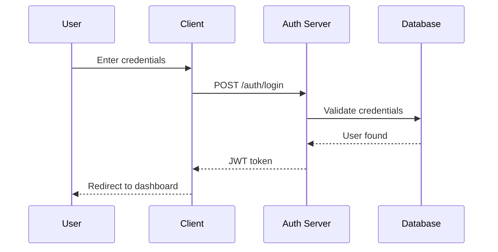

# Chapter 9: Power User Secrets

The tips and tricks that separate casual users from Claude Code wizards. Most of these aren't in any official documentation.

## Extended Thinking Commands

Force Claude to think deeper on complex problems.

### ultrathink

```
ultrathink about how to architect this authentication system
```

Triggers extended reasoning. Claude will:
- Consider multiple approaches
- Evaluate trade-offs
- Provide more thorough analysis
- Take longer but produce better results

### Other Thinking Triggers

```
think step by step about this refactoring
```

```
think harder about edge cases here
```

```
think deeply about the security implications
```

```
reason through this carefully before implementing
```

These phrases engage Claude's extended thinking capabilities, especially useful for:
- Architecture decisions
- Complex debugging
- Security analysis
- Performance optimization

## Multi-Window Power Moves

Don't wait for one task to finish. Run multiple Claude Code instances on different feature branches simultaneously using **git worktrees**.

### The Problem

Git tracks branches at the repository level. You can't have two terminals in the same folder on different branches - switching in one affects both.

### The Solution: Git Worktrees

Worktrees let you check out multiple branches in separate directories, all linked to the same repo.

```
myproject/                    # main branch
myproject-dashboard/          # feature/user-dashboard branch
myproject-notifications/      # feature/email-notifs branch
```

### Setup

**Create worktrees for each feature:**
```bash
# From your main project directory
git worktree add ../myproject-dashboard feature/user-dashboard
git worktree add ../myproject-notifications feature/email-notifications
```

**Open terminals in each directory:**
```
┌─────────────────────────────┬─────────────────────────────┐
│  Terminal 1                 │  Terminal 2                 │
│  cd myproject-dashboard     │  cd myproject-notifications │
│  claude                     │  claude                     │
│                             │                             │
│  "Add the stats cards"      │  "Set up email service"     │
└─────────────────────────────┴─────────────────────────────┘
```

### Practical Example

```bash
# Setup (one time)
git worktree add ../app-dark-mode -b feature/dark-mode
git worktree add ../app-export -b feature/export-csv
git worktree add ../app-shortcuts -b feature/keyboard-shortcuts

# Terminal 1
cd ../app-dark-mode
claude
"Implement dark mode toggle in settings"

# Terminal 2 (simultaneously)
cd ../app-export
claude
"Add CSV export to reports page"

# Terminal 3 (simultaneously)
cd ../app-shortcuts
claude
"Add keyboard shortcuts for common actions"
```

Now you have three Claude sessions working on three features in parallel.

### Why This Works

- Each worktree is a separate directory with its own branch
- Each Claude session has isolated context
- Changes don't interfere with each other
- You 2-3x your throughput instead of waiting

### Cleanup

When done with a feature:
```bash
# Merge the feature
cd myproject
git merge feature/dark-mode

# Remove the worktree
git worktree remove ../app-dark-mode
```

### Cross-Prompting Between Worktrees

Copy useful patterns between sessions:

**Terminal 1 created a utility:**
```
I need a utility to format dates consistently
```
*Claude creates formatDate.ts*

**Terminal 2 needs the same pattern:**
```
In another worktree we created this date formatting utility:
[paste the code]

Use the same pattern for timestamps in email notifications
```

### Best Practices

1. **Keep features independent** - Don't work on overlapping files
2. **Name worktrees clearly** - `app-featurename` pattern works well
3. **Clean up after merge** - Remove worktrees you're done with
4. **Merge to main regularly** - Avoid divergence between branches

## Screenshot and Image Input

Claude Code can see images. Drag and drop screenshots directly into your terminal.

### How It Works

1. Take a screenshot (Cmd+Shift+4 on Mac)
2. Drag the image file into your Claude Code terminal
3. Ask about it

### Use Cases

**UI Debugging:**
```
[drag screenshot of broken layout]
What's wrong with this layout? The button should be aligned right.
```

**Design Implementation:**
```
[drag mockup image]
Implement this design using Tailwind CSS
```

**Error Screenshots:**
```
[drag screenshot of error dialog]
What does this error mean and how do I fix it?
```

**Comparing UIs:**
```
[drag two screenshots]
What are the differences between these two versions?
```

## Mermaid Diagram Generation

Have Claude create visual diagrams you can render anywhere.

### Architecture Diagrams

```
Generate a mermaid diagram showing the authentication flow in this app
```

Output:


### Where to Render

- **[mermaid.live](https://mermaid.live/)** - Online editor with live preview
- **GitHub** - Renders mermaid in markdown files and comments
- **VS Code** - With mermaid preview extension
- **Notion** - Supports mermaid code blocks

### Diagram Types

```
Create a mermaid flowchart showing the order processing states
```

```
Generate a mermaid class diagram for the data models
```

```
Make a mermaid ER diagram of the database schema
```

## Memory Bank Pattern

Persist context across sessions without bloating CLAUDE.md.

### Setup

Create a memory directory:

```bash
mkdir -p .claude/memory
```

### Session Memory File

```markdown
# .claude/memory/current-session.md

## Active Focus
Implementing user dashboard feature

## Decisions Made
- Using React Query for data fetching (decided 2024-01-15)
- Chart library: Recharts (lighter than D3 for our needs)
- State: Zustand (team already familiar)

## Blocked On
- Waiting for design review on mobile layout
- Need API endpoint for activity feed

## Recent Changes
- Added DashboardLayout component
- Created useUserStats hook
- Set up Recharts for usage graphs

## Next Steps
1. Implement activity feed once API ready
2. Add export functionality
3. Mobile responsive tweaks
```

### Using Memory Files

Start sessions with:
```
Read .claude/memory/current-session.md and continue where we left off
```

Update at end of sessions:
```
Update .claude/memory/current-session.md with our progress today
```

### Memory Categories

```
.claude/memory/
├── current-session.md    # What you're working on now
├── decisions.md          # Architecture decisions log
├── blockers.md           # Current blockers and dependencies
└── learnings.md          # Things Claude learned about your codebase
```

## Token Optimization Tricks

Save money and improve response quality.

### The /compact Command

```
/compact
```

Summarizes the current context, reducing token usage while preserving important information.

### Reference, Don't Paste

**Bad (wastes tokens):**
```
Here's the code:
[pastes 500 lines]

Fix the bug in this
```

**Good (efficient):**
```
Fix the bug in src/auth/login.ts around line 45
```

Claude will read the file itself, only loading what it needs.

### Strategic /clear

```
/clear
```

Use between:
- Unrelated tasks
- After completing a feature
- When Claude seems confused
- Before starting something new

Don't keep stale context around "just in case."

### Break Up Large Tasks

**Bad:**
```
Refactor the entire authentication system, add OAuth support,
implement refresh tokens, add rate limiting, and write tests for everything
```

**Good:**
```
Session 1: "Refactor auth module structure"
/clear
Session 2: "Add OAuth support"
/clear
Session 3: "Implement refresh tokens"
...
```

## Model Switching Strategies

Different models for different tasks.

### When to Use Each Model

| Model | Best For | Cost |
|-------|----------|------|
| **opus** | Complex architecture, security review, novel problems | $$$ |
| **sonnet** | General coding, everyday tasks (default) | $$ |
| **haiku** | Quick questions, simple tasks, high volume | $ |

### Switching Models

```
/model opus
```

### Strategic Model Usage

**Start complex features with opus:**
```
/model opus
Plan the architecture for user permissions system
```

**Switch to sonnet for implementation:**
```
/model sonnet
Implement the permission checking middleware we discussed
```

**Use haiku for quick checks:**
```
/model haiku
Does this regex pattern look correct? /^[\w-]+@[\w-]+\.[\w-]+$/
```

## Headless Mode Automation

Script Claude Code for CI/CD and automation.

### Basic Headless

```bash
claude -p "analyze this PR for security issues" --headless
```

Runs without interactive prompts, outputs to stdout.

### JSON Output

```bash
claude -p "list all TODO comments" --headless --json | jq '.todos'
```

Structured output for scripting.

### Pipeline Integration

```bash
# Log monitoring
tail -f /var/log/app.log | claude -p "alert me about errors" --headless

# Automated review
git diff HEAD~1 | claude -p "summarize these changes" --headless

# Pre-commit hook
claude -p "check staged files for secrets" --headless || exit 1
```

### CI/CD Script

```bash
#!/bin/bash
# review.sh

REVIEW=$(claude -p "review the diff for issues" --headless --json)
ISSUES=$(echo $REVIEW | jq '.issues | length')

if [ "$ISSUES" -gt 0 ]; then
  echo "Found $ISSUES issues:"
  echo $REVIEW | jq '.issues'
  exit 1
fi

echo "No issues found"
exit 0
```

## The Checkpoint Safety Net

Create restore points before risky operations.

### Before Big Changes

```
/checkpoint create "before auth refactor"
```

### Do the Scary Thing

```
Completely refactor the authentication module to use JWT
```

### If It Goes Wrong

```
/checkpoint list
/checkpoint restore abc123
```

### When to Checkpoint

- Before major refactors
- Before deleting code
- Before architectural changes
- Before "let's try something crazy"

## Hidden Productivity Hacks

### The "As If" Pattern

```
Implement this as if you were a senior engineer at Stripe
```

```
Review this code as if it's going to production tomorrow
```

```
Document this as if a new hire will read it on their first day
```

Sets quality expectations without explicit requirements.

### The Constraint Pattern

```
Implement this in under 50 lines
```

```
Solve this without adding new dependencies
```

```
Fix this without changing the public API
```

Constraints often lead to better solutions.

### The Explain First Pattern

```
Before implementing, explain your approach in 2-3 sentences
```

Forces Claude to think before acting. Catch bad approaches early.

### The Rubber Duck Prompt

```
I'm stuck on [problem]. Ask me questions to help me figure it out.
```

Claude as debugging partner, not just code generator.

## Debugging Claude Itself

When Claude isn't performing well:

### Context Pollution

**Symptom:** Irrelevant responses, confusion about the task

**Fix:**
```
/clear
```

### Wrong Mental Model

**Symptom:** Claude keeps trying the wrong approach

**Fix:**
```
Stop. Let me clarify: [explicit clarification]
The goal is [specific goal], not [what Claude thinks]
```

### Token Exhaustion

**Symptom:** Truncated responses, forgotten context

**Fix:**
```
/compact
```
Or `/clear` and start fresh with focused context.

### Model Mismatch

**Symptom:** Oversimplified or overcomplicated solutions

**Fix:**
```
/model opus  # For complex tasks
/model haiku # For simple tasks
```

## Quick Reference

```bash
# Extended thinking
"ultrathink about..."
"think step by step..."
"think harder about..."

# Multi-window
# Just open multiple terminals with 'claude'

# Screenshots
# Drag image file into terminal

# Mermaid diagrams
"Generate a mermaid diagram showing..."

# Memory bank
.claude/memory/current-session.md

# Token optimization
/compact
/clear
Reference files by path

# Model switching
/model opus|sonnet|haiku

# Headless automation
claude -p "task" --headless --json

# Checkpoints
/checkpoint create "name"
/checkpoint restore <id>
```

---

[← Previous: Production Workflows](./08-production-workflows.md) | [Next: Vibe Coding Philosophy →](./10-vibe-coding.md)
